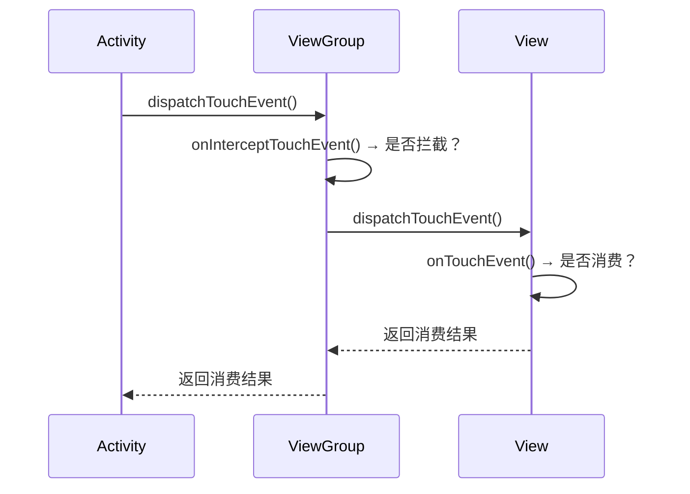
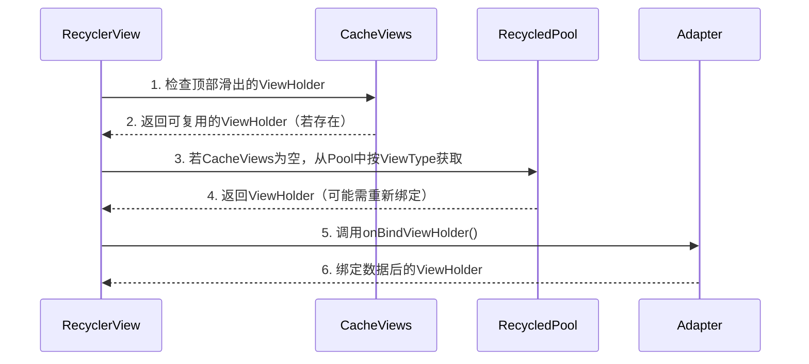

### **Android 事件分发机制详解**

Android 的事件分发机制是指 **触摸事件（TouchEvent）** 从屏幕到应用的传递和处理过程，涉及 **Activity → ViewGroup → View** 的三层协作。核心方法是 `dispatchTouchEvent()`、`onInterceptTouchEvent()` 和 `onTouchEvent()`。

---

## **📌 1. 事件分发核心方法**
| **方法**                     | **调用者**       | **作用**                                                                 |
|------------------------------|-----------------|-------------------------------------------------------------------------|
| `dispatchTouchEvent()`        | Activity/View   | 事件分发入口，决定是否向下传递或自行处理。                                |
| `onInterceptTouchEvent()`     | **仅 ViewGroup** | 是否拦截事件（ViewGroup 特有）。                                        |
| `onTouchEvent()`              | Activity/View   | 事件处理的最终方法，返回 `true` 表示已消费事件。                         |

---

## **📌 2. 事件分发流程（U型传递）**


1. **Activity 优先处理**  
   - `Activity.dispatchTouchEvent()` 首先接收到触摸事件。
   - 若 Activity 不处理，则传递给根 ViewGroup。

2. **ViewGroup 决定是否拦截**  
   - `ViewGroup.onInterceptTouchEvent()` 返回 `true` 时拦截事件，不再向下传递，转由自己的 `onTouchEvent()` 处理。

3. **View 处理事件**  
   - 若事件到达 View，调用 `View.onTouchEvent()`。
   - 若 View 不消费事件，事件会依次回传给父容器的 `onTouchEvent()`。

---

## **📌 3. 关键规则**
### **(1) 事件消费原则**
- **谁消费，谁处理**：一旦某个 View 或 ViewGroup 的 `onTouchEvent()` 返回 `true`，后续事件（如 `MOVE`、`UP`）会直接分发给它，不再询问其他 View。
- **拦截后不回溯**：若 ViewGroup 拦截事件（`onInterceptTouchEvent()` 返回 `true`），子 View 会收到 `ACTION_CANCEL`，后续事件由该 ViewGroup 处理。

### **(2) 事件传递优先级**
1. **OnTouchListener** > `onTouchEvent()`  
   若设置了 `View.setOnTouchListener` 且返回 `true`，则 `onTouchEvent()` 不会被调用。
2. **OnClickListener**  
   在 `onTouchEvent()` 的 `ACTION_UP` 中触发，优先级最低。

---

## **📌 4. 常见场景分析**
### **场景 1：点击按钮**
```plaintext
Activity → DecorView → LinearLayout → Button
```
1. 事件从 Activity 传递到 Button。
2. Button 的 `onTouchEvent()` 返回 `true`，消费点击事件。
3. 触发 `OnClickListener`。

### **场景 2：滑动冲突（ScrollView 内嵌 ListView）**
1. **默认行为**：  
   - `ScrollView.onInterceptTouchEvent()` 在检测到滑动时拦截事件，导致 `ListView` 无法滚动。
2. **解决方案**：  
   - 重写 `ScrollView.onInterceptTouchEvent()`，根据滑动方向决定是否拦截。

---

## **📌 5. 实战技巧**
### **(1) 自定义事件分发逻辑**
```java
@Override
public boolean onInterceptTouchEvent(MotionEvent ev) {
    if (ev.getAction() == MotionEvent.ACTION_MOVE) {
        // 根据业务逻辑决定是否拦截
        return shouldIntercept;
    }
    return super.onInterceptTouchEvent(ev);
}
```

### **(2) 调试事件分发**
- **打印日志**：  
  ```java
  @Override
  public boolean dispatchTouchEvent(MotionEvent ev) {
      Log.d("Event", "dispatchTouchEvent: " + ev.getAction());
      return super.dispatchTouchEvent(ev);
  }
  ```
- **使用 Android Studio 的 Layout Inspector**：查看触摸事件传递路径。

---

## **📌 6. 总结**
| **关键点**               | **说明**                                                                 |
|--------------------------|-------------------------------------------------------------------------|
| **事件流向**             | Activity → ViewGroup → View → 回传                                       |
| **拦截时机**             | `ViewGroup.onInterceptTouchEvent()` 可中断向下传递。                     |
| **消费优先级**           | `OnTouchListener` > `onTouchEvent()` > `OnClickListener`                |
| **滑动冲突解决**         | 重写 `onInterceptTouchEvent()` 或 `requestDisallowInterceptTouchEvent()` |

理解事件分发机制能帮助你解决 **滑动冲突**、**自定义触摸反馈** 等复杂交互问题。


### **ScrollView 和 ListView 的实现与使用详解**

#### **1. ScrollView（垂直滚动布局）**
**作用**：实现内容的垂直滚动，内部只能包含一个直接子View（通常是LinearLayout等布局）。

##### **基本使用**
```xml
<ScrollView
    android:layout_width="match_parent"
    android:layout_height="match_parent">

    <LinearLayout
        android:layout_width="match_parent"
        android:layout_height="wrap_content"
        android:orientation="vertical">

        <!-- 多个子View（内容高度超出屏幕时会滚动） -->
        <TextView android:text="Item 1"/>
        <TextView android:text="Item 2"/>
        <!-- ... -->
    </LinearLayout>
</ScrollView>
```

##### **特性**
- **仅支持垂直滚动**（水平滚动用 `HorizontalScrollView`）。
- **不适合长列表**：会一次性加载所有子View，内存占用高。

---

#### **2. ListView（列表控件）**
**作用**：高效展示长列表数据，通过复用Item View减少内存消耗。

##### **基本使用**
**步骤1：定义Item布局**  
`item_list.xml`：
```xml
<TextView xmlns:android="http://schemas.android.com/apk/res/android"
    android:id="@+id/item_text"
    android:layout_width="match_parent"
    android:layout_height="50dp"/>
```

**步骤2：创建Adapter**  
```java
public class MyAdapter extends BaseAdapter {
    private List<String> mData;
    private LayoutInflater mInflater;

    public MyAdapter(Context context, List<String> data) {
        mData = data;
        mInflater = LayoutInflater.from(context);
    }

    @Override
    public View getView(int position, View convertView, ViewGroup parent) {
        ViewHolder holder;
        if (convertView == null) {
            convertView = mInflater.inflate(R.layout.item_list, parent, false);
            holder = new ViewHolder();
            holder.textView = convertView.findViewById(R.id.item_text);
            convertView.setTag(holder);
        } else {
            holder = (ViewHolder) convertView.getTag();
        }
        holder.textView.setText(mData.get(position));
        return convertView;
    }

    static class ViewHolder {
        TextView textView;
    }

    // 其他必须重写的方法（getCount, getItem等）
}
```

**步骤3：设置ListView**  
```java
ListView listView = findViewById(R.id.list_view);
List<String> data = Arrays.asList("Apple", "Banana", "Orange");
listView.setAdapter(new MyAdapter(this, data));

// 点击事件
listView.setOnItemClickListener((parent, view, position, id) -> {
    Toast.makeText(this, "Clicked: " + data.get(position), Toast.LENGTH_SHORT).show();
});
```

##### **优化技巧**
- **ViewHolder模式**：复用Item View（如上例）。
- **分页加载**：结合后端API实现分批加载数据。

---

#### **3. ScrollView 嵌套 ListView 的问题与解决**
**问题**：ListView 在 ScrollView 中会失去滚动复用特性，导致所有Item一次性加载。

##### **解决方案**
**方法1：固定ListView高度**  
```xml
<ListView
    android:layout_width="match_parent"
    android:layout_height="200dp" <!-- 明确高度 -->
    android:nestedScrollingEnabled="true"/>
```

**方法2：动态计算ListView高度**  
```java
public static void setListViewHeight(ListView listView) {
    Adapter adapter = listView.getAdapter();
    if (adapter == null) return;

    int totalHeight = 0;
    for (int i = 0; i < adapter.getCount(); i++) {
        View item = adapter.getView(i, null, listView);
        item.measure(0, 0);
        totalHeight += item.getMeasuredHeight();
    }

    ViewGroup.LayoutParams params = listView.getLayoutParams();
    params.height = totalHeight + (listView.getDividerHeight() * (adapter.getCount() - 1));
    listView.setLayoutParams(params);
}
```

**方法3：替换为RecyclerView**  
RecyclerView 默认支持嵌套滚动，更灵活：
```xml
<androidx.core.widget.NestedScrollView>
    <LinearLayout>
        <TextView android:text="Header"/>
        <androidx.recyclerview.widget.RecyclerView
            android:layout_width="match_parent"
            android:layout_height="wrap_content"
            android:nestedScrollingEnabled="false"/> <!-- 禁用独立滚动 -->
    </LinearLayout>
</androidx.core.widget.NestedScrollView>
```

---

#### **4. 对比与选型**
| **控件**       | **适用场景**                | **优点**                          | **缺点**                     |
|----------------|---------------------------|----------------------------------|-----------------------------|
| **ScrollView** | 短内容垂直滚动              | 简单易用                         | 无法复用View，内存消耗大      |
| **ListView**   | 长列表数据展示              | 支持View复用                     | 功能较基础，需手动优化        |
| **RecyclerView**| 复杂列表/网格布局           | 高度灵活，内置优化               | 配置稍复杂                  |

---

#### **5. 最佳实践**
- **简单滚动布局** → 直接用 `ScrollView`。
- **长列表** → 优先选择 `RecyclerView`，其次 `ListView`。
- **嵌套滚动** → 使用 `RecyclerView + NestedScrollView` 并禁用子滚动。

通过合理选择控件和优化Adapter，可以平衡性能与开发效率。


### **RecyclerView 深度解析**

RecyclerView 是 Android 中用于展示**高效可滚动列表**的控件，相比 ListView 具有更强的灵活性和性能优势。以下是其核心机制和实战指南：

---

#### **一、RecyclerView 核心组成**
| **组件**            | **作用**                                                                 |
|---------------------|-------------------------------------------------------------------------|
| **RecyclerView**    | 列表容器，负责整体布局和滚动管理。                                       |
| **Adapter**         | 管理数据集合，创建和绑定 Item 视图。                                     |
| **ViewHolder**      | 缓存 Item 视图，避免重复 `findViewById`。                                |
| **LayoutManager**   | 控制 Item 的排列方式（线性、网格、瀑布流等）。                            |
| **ItemDecoration**  | 添加 Item 间的分割线、间距等装饰。                                       |
| **ItemAnimator**    | 处理 Item 的增删改动画。                                                 |

---

#### **二、基础使用步骤**
##### **1. 添加依赖**
```gradle
implementation 'androidx.recyclerview:recyclerview:1.3.2'
```

##### **2. 定义 Item 布局**
`item_user.xml`：
```xml
<LinearLayout xmlns:android="http://schemas.android.com/apk/res/android"
    android:layout_width="match_parent"
    android:layout_height="wrap_content">
    <TextView
        android:id="@+id/tv_name"
        android:layout_width="wrap_content"
        android:layout_height="50dp"/>
</LinearLayout>
```

##### **3. 创建 Adapter**
```java
public class UserAdapter extends RecyclerView.Adapter<UserAdapter.ViewHolder> {
    private List<String> mData;

    public UserAdapter(List<String> data) {
        mData = data;
    }

    // 创建 ViewHolder
    @Override
    public ViewHolder onCreateViewHolder(ViewGroup parent, int viewType) {
        View view = LayoutInflater.from(parent.getContext())
                .inflate(R.layout.item_user, parent, false);
        return new ViewHolder(view);
    }

    // 绑定数据
    @Override
    public void onBindViewHolder(ViewHolder holder, int position) {
        holder.tvName.setText(mData.get(position));
    }

    @Override
    public int getItemCount() {
        return mData.size();
    }

    // ViewHolder 类
    public static class ViewHolder extends RecyclerView.ViewHolder {
        TextView tvName;
        public ViewHolder(View itemView) {
            super(itemView);
            tvName = itemView.findViewById(R.id.tv_name);
        }
    }
}
```

##### **4. 设置 RecyclerView**
```java
RecyclerView recyclerView = findViewById(R.id.recycler_view);
List<String> data = Arrays.asList("Alice", "Bob", "Charlie");

// 必选：设置 LayoutManager
recyclerView.setLayoutManager(new LinearLayoutManager(this));

// 可选：设置分割线
recyclerView.addItemDecoration(new DividerItemDecoration(this, DividerItemDecoration.VERTICAL));

// 设置 Adapter
recyclerView.setAdapter(new UserAdapter(data));

// 点击事件（通过接口回调）
adapter.setOnItemClickListener(position -> {
    Toast.makeText(this, "Clicked: " + data.get(position), Toast.LENGTH_SHORT).show();
});
```

---

#### **三、高级功能详解**
##### **1. 多布局类型**
```java
// Adapter 中重写方法
@Override
public int getItemViewType(int position) {
    return position % 2 == 0 ? TYPE_HEADER : TYPE_NORMAL;
}

@Override
public ViewHolder onCreateViewHolder(ViewGroup parent, int viewType) {
    if (viewType == TYPE_HEADER) {
        return new HeaderHolder(inflate(R.layout.item_header));
    } else {
        return new NormalHolder(inflate(R.layout.item_normal));
    }
}
```

##### **2. 数据动态更新**
```java
// 差分更新（高效刷新）
DiffUtil.DiffResult result = DiffUtil.calculateDiff(new UserDiffCallback(oldList, newList));
result.dispatchUpdatesTo(adapter);

// 单条更新
adapter.notifyItemInserted(position);
adapter.notifyItemRemoved(position);
```

##### **3. 嵌套滚动优化**
```xml
<androidx.core.widget.NestedScrollView>
    <LinearLayout>
        <TextView android:text="Header"/>
        <RecyclerView
            android:layout_width="match_parent"
            android:layout_height="wrap_content"
            android:nestedScrollingEnabled="false"/> <!-- 禁用独立滚动 -->
    </LinearLayout>
</androidx.core.widget.NestedScrollView>
```

##### **4. 下拉刷新/上拉加载**
```gradle
implementation 'androidx.swiperefreshlayout:swiperefreshlayout:1.1.0'
```
```java
SwipeRefreshLayout refreshLayout = findViewById(R.id.refresh_layout);
refreshLayout.setOnRefreshListener(() -> {
    // 加载新数据后停止刷新
    adapter.notifyDataSetChanged();
    refreshLayout.setRefreshing(false);
});
```

---

#### **四、性能优化技巧**
1. **ViewHolder 模式**：必须使用，避免重复查找视图。
2. **差分更新**：`DiffUtil` 比 `notifyDataSetChanged()` 更高效。
3. **固定尺寸**：若 Item 高度一致，设置 `recyclerView.setHasFixedSize(true)`。
4. **图片加载**：使用 Glide/Picasso 避免主线程加载。

---

#### **五、与 ListView 对比**
| **特性**          | **RecyclerView**                  | **ListView**                  |
|-------------------|----------------------------------|-------------------------------|
| **View 复用**     | 强制使用 ViewHolder               | 需手动优化                     |
| **布局管理**      | 通过 LayoutManager 灵活控制       | 仅支持垂直列表                 |
| **动画支持**      | 内置默认动画，可自定义            | 需手动实现                     |
| **扩展性**        | 支持 ItemDecoration/ItemAnimator  | 功能有限                      |

---

#### **六、最佳实践场景**
- **简单列表** → `LinearLayoutManager`
- **网格布局** → `GridLayoutManager`
- **复杂交互动画** → 自定义 `ItemAnimator`
- **大数据集** → 结合 `Paging` 库分页加载

RecyclerView 通过解耦的设计，成为现代 Android 开发中列表展示的首选方案。


### **RecyclerView 的复用机制实现原理**

RecyclerView 的复用机制是其高性能的核心，通过 **四级缓存** 和 **动态绑定** 实现 View 的高效复用，避免频繁创建和销毁 Item 视图。以下是详细解析：

---

#### **一、四级缓存结构**
RecyclerView 通过四级缓存管理 ViewHolder 的复用：

| **缓存等级**       | **存储内容**                              | **生命周期**                  | **触发条件**                     |
|--------------------|-----------------------------------------|-----------------------------|--------------------------------|
| **1. Attached Scrap** | 当前屏幕可见的 ViewHolder                | 布局期间临时保存              | `onLayout` 时临时移除再重新附加 |
| **2. Cache Views**    | 刚滑出屏幕的 ViewHolder（可立即复用）     | 优先级高于 Recycled Pool      | 新 Item 进入屏幕时优先检查      |
| **3. Recycled Pool**  | 滑出屏幕且被回收的 ViewHolder（需重新绑定）| 长期保存，按 ViewType 分类    | Cache Views 不足时使用         |
| **4. ViewCacheExtension** | 开发者自定义缓存（通常不用）            | 由开发者控制                 | 手动调用                        |

---

#### **二、复用流程详解**
以 **向下滑动列表** 为例：


1. **滑动时**：顶部 Item 滑出屏幕，其 ViewHolder 存入 **Cache Views**。
2. **新 Item 进入屏幕**：
   - 优先从 **Cache Views** 获取相同位置的 ViewHolder（无需重新绑定）。
   - 若未命中，则从 **Recycled Pool** 获取同类型的 ViewHolder（需重新绑定数据）。
3. **绑定数据**：通过 `onBindViewHolder()` 更新 ViewHolder 内容。

---

#### **三、关键源码分析**
##### **1. 获取复用 ViewHolder (`Recycler.getViewForPosition`)**
```java
ViewHolder tryGetViewHolderForPositionByDeadline(int position) {
    // 1. 检查Attached Scrap和Cache Views
    ViewHolder holder = getScrapOrHiddenOrCachedHolderForPosition(position);
    if (holder != null) {
        return holder;
    }

    // 2. 从Recycled Pool获取
    holder = getRecycledViewPool().getRecycledView(type);
    if (holder != null) {
        holder.resetInternal(); // 重置状态
        return holder;
    }

    // 3. 创建新的ViewHolder
    return adapter.createViewHolder(RecyclerView.this, type);
}
```

##### **2. 回收 ViewHolder (`Recycler.recycleViewHolderInternal`)**
```java
void recycleViewHolderInternal(ViewHolder holder) {
    if (holder.isRecyclable()) {
        if (mViewCacheMax > 0 && holder.isUpdated()) {
            // 存入Cache Views
            mCachedViews.add(holder);
        } else {
            // 存入Recycled Pool
            getRecycledViewPool().putRecycledView(holder);
        }
    }
}
```

---

#### **四、复用机制的优势**
1. **减少对象创建**：避免频繁 `inflate()` 布局。
2. **降低内存占用**：同一时刻仅保存有限数量的 ViewHolder。
3. **提升滑动流畅度**：复用已存在的视图，减少布局计算。

---

#### **五、开发者优化实践**
##### **1. 优化 `onBindViewHolder`**
```java
@Override
public void onBindViewHolder(ViewHolder holder, int position) {
    // 避免耗时操作（如网络请求）
    User user = mData.get(position);
    holder.name.setText(user.getName());
    
    // 使用Glide异步加载图片
    Glide.with(holder.itemView).load(user.getAvatar()).into(holder.avatar);
}
```

##### **2. 合理设置 ViewType**
```java
@Override
public int getItemViewType(int position) {
    // 确保相同类型的Item复用效率最高
    return mData.get(position).getType();
}
```

##### **3. 调整缓存大小**
```java
// 增大CacheViews容量（默认=2）
recyclerView.setItemViewCacheSize(10);

// 扩大Recycled Pool的缓存数量（按ViewType分类）
recyclerView.getRecycledViewPool().setMaxRecycledViews(TYPE_TEXT, 20);
```

##### **4. 避免嵌套测量**
```xml
<!-- 确保Item布局高度固定或简单 -->
<LinearLayout
    android:layout_width="match_parent"
    android:layout_height="100dp"> <!-- 明确高度 -->
</LinearLayout>
```

---

#### **六、对比 ListView 的复用**
| **特性**          | **RecyclerView**                          | **ListView**                  |
|-------------------|------------------------------------------|-------------------------------|
| **缓存结构**      | 四级缓存（精细控制）                      | 两级复用（Active + Scrap）     |
| **复用单位**      | ViewHolder（包含视图和数据绑定）           | 仅复用 View 对象               |
| **灵活性**        | 支持不同 ViewType 的独立缓存               | 所有 Item 共用同一复用池       |

---

#### **七、常见问题**
**Q1：为什么有时 `onBindViewHolder` 会被频繁调用？**  
- **原因**：Cache Views 已满或 ViewType 不匹配，导致无法复用。  
- **解决**：增加缓存大小或检查 `getItemViewType()` 逻辑。

**Q2：如何避免图片错乱？**  
- **原因**：复用 ViewHolder 时未重置旧数据。  
- **解决**：在 `onBindViewHolder` 中始终设置完整数据：
  ```java
  holder.avatar.setImageResource(R.drawable.placeholder); // 先重置
  Glide.load(data.getAvatar()).into(holder.avatar);      // 再加载
  ```

---

通过理解 RecyclerView 的复用机制，可以显著提升列表性能，尤其在处理复杂布局或大数据集时效果突出。