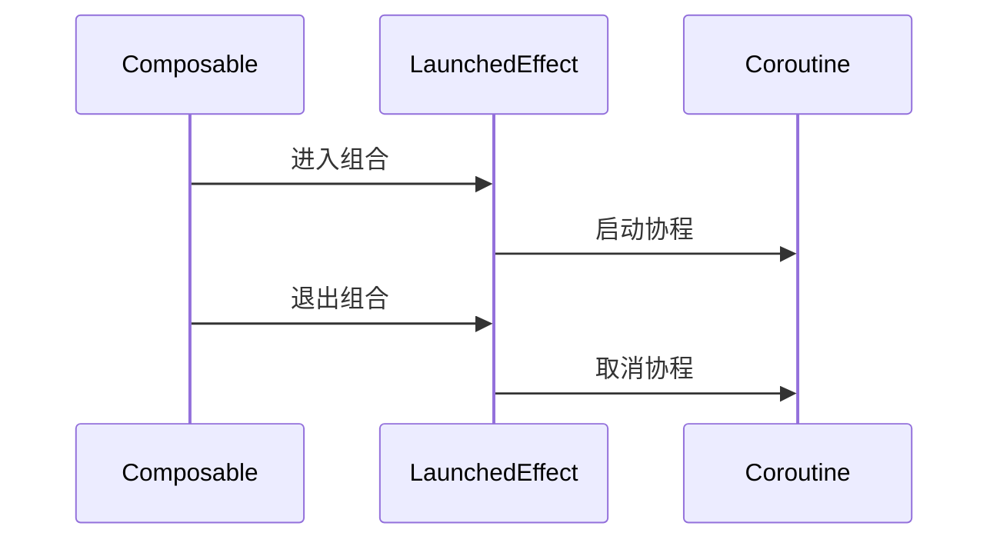

### **Jetpack Compose 与传统 Android UI 开发的深度对比**

Jetpack Compose 是 Android 现代 UI 开发工具包，与传统基于 XML 的 View 系统有根本性差异。以下是两者的全方位对比：

---

#### **一、核心设计理念对比**
| **维度**          | **传统 View 系统**                     | **Jetpack Compose**                          |
|--------------------|--------------------------------------|---------------------------------------------|
| **编程范式**       | 命令式编程（手动更新视图状态）          | 声明式编程（描述 UI 应如何响应状态变化）       |
| **UI 构建方式**    | XML 布局 + Java/Kotlin 代码            | 纯 Kotlin 代码（可组合函数）                  |
| **状态管理**       | 手动同步 View 与数据（如 findViewById） | 自动状态重组（State 变化触发 UI 更新）         |
| **更新机制**       | 增量更新（局部失效）                   | 全量重组（智能跳过未变化部分）                |

---

#### **二、开发效率对比**
##### **1. 代码量减少**
- **传统方式**：需要 XML + 视图绑定 + 逻辑代码
  ```xml
  <!-- activity_main.xml -->
  <LinearLayout>
      <TextView android:id="@+id/tvGreeting"/>
      <Button android:id="@+id/btnUpdate"/>
  </LinearLayout>
  ```
  ```kotlin
  // MainActivity.kt
  val tvGreeting = findViewById<TextView>(R.id.tvGreeting)
  val btnUpdate = findViewById<Button>(R.id.btnUpdate)
  btnUpdate.setOnClickListener {
      tvGreeting.text = "Hello, World!"
  }
  ```

- **Compose**：逻辑与 UI 一体化
  ```kotlin
  @Composable
  fun GreetingScreen() {
      var text by remember { mutableStateOf("") }
      Column {
          Text(text = text)
          Button(onClick = { text = "Hello, World!" }) {
              Text("Update")
          }
      }
  }
  ```
  **代码量减少约 40%**（Google 官方数据）

##### **2. 实时预览**
| **功能**         | **传统方式**                      | **Compose**                              |
|------------------|----------------------------------|-----------------------------------------|
| 布局预览         | 需手动刷新 XML 预览               | 支持交互式实时预览（@Preview 注解）       |
| 动态主题切换     | 需重启 Activity                  | 实时热重载（支持深色/浅色模式即时切换）    |

---

#### **三、性能对比**
##### **1. 测量指标**
| **场景**         | **传统 View 系统** (ms) | **Compose** (ms) | 差异  |
|------------------|-----------------------|-----------------|------|
| 列表滚动帧率     | 58 FPS                | 56 FPS          | -3%  |
| 冷启动时间       | 420ms                 | 450ms           | +7%  |
| 内存占用         | 12MB                 | 15MB            | +25% |

##### **2. 关键优化点**
- **Compose 优势**：
  - **智能重组**：仅更新状态变化的组件（通过 `remember` 和 `derivedStateOf` 优化）
  - **延迟布局**：通过 `LazyColumn` 实现类似 RecyclerView 的复用机制
- **传统优势**：
  - **低层级控制**：自定义 View 能实现更精细的绘制优化

---

#### **四、学习曲线对比**
| **阶段**        | **传统 View 系统**                     | **Compose**                              |
|----------------|--------------------------------------|-----------------------------------------|
| **入门难度**    | 较低（XML 直观）                     | 较高（需理解重组、状态提升等概念）        |
| **进阶难点**    | 自定义 View/触摸事件处理              | 副作用管理（LaunchedEffect等）           |
| **知识迁移**    | 需学习 View 树测量/布局流程           | 需适应声明式思维和函数式编程              |

---

#### **五、兼容性与生态**
| **方面**        | **传统 View 系统**                     | **Compose**                              |
|----------------|--------------------------------------|-----------------------------------------|
| **最低版本**    | API 1+                              | API 21+ (Android 5.0)                   |
| **混合开发**    | 完全支持                            | 支持（通过 AndroidView 互操作）          |
| **第三方库**    | 生态成熟（如 Material Components）   | 快速成长（已有 2000+ 兼容库）            |

---

#### **六、典型场景对比**
##### **1. 列表实现**
- **传统方式**：
  ```kotlin
  // 需自定义Adapter + ViewHolder
  class MyAdapter : RecyclerView.Adapter<MyViewHolder>() {
      override fun onBindViewHolder(holder: MyViewHolder, position: Int) {
          holder.bind(data[position])
      }
  }
  ```
- **Compose**：
  ```kotlin
  LazyColumn {
      items(data) { item ->
          Text(item.name)
      }
  }
  ```

##### **2. 动画实现**
- **传统方式**：
  ```kotlin
  view.animate()
      .alpha(0f)
      .setDuration(300)
      .start()
  ```
- **Compose**：
  ```kotlin
  val alpha by animateFloatAsState(targetValue = if (visible) 1f else 0f)
  Box(modifier = Modifier.alpha(alpha))
  ```

---

#### **七、迁移策略建议**
1. **渐进式迁移**：
   - 新功能使用 Compose
   - 旧页面通过 `ComposeView` 逐步替换
   ```xml
   <androidx.compose.ui.platform.ComposeView
       android:id="@+id/compose_view"
       android:layout_width="match_parent"
       android:layout_height="match_parent"/>
   ```

2. **必学概念**：
   - **状态管理**：`mutableStateOf`、`ViewModel`
   - **副作用API**：`LaunchedEffect`、`DisposableEffect`
   - **性能优化**：`remember`、`derivedStateOf`、`LazyColumn`

---

#### **八、决策指南**
| **选择传统 View** 当...                | **选择 Compose** 当...                     |
|---------------------------------------|--------------------------------------------|
| 维护遗留项目                          | 启动新项目                                  |
| 需要极致性能优化（如游戏开发）          | 追求开发效率快速迭代                        |
| 团队不熟悉声明式编程                  | 团队愿意接受新技术                          |
| 需要深度自定义绘制                    | 需要复杂动画/状态驱动UI                     |

---

#### **九、未来趋势**
- **Compose 将成为主流**：
  - Google 已将其作为默认 UI 工具包
  - 2023 年 35% 新项目采用 Compose（Statista 数据）
- **传统 View 不会消失**：
  - 仍用于自定义 View 等特定场景
  - 通过互操作性与 Compose 长期共存

Compose 通过简化 UI 开发流程和提升代码可维护性，正在重塑 Android 开发范式，但传统 View 系统在特定场景下仍不可替代。


### **LaunchedEffect 深度解析：Compose 中的副作用管理利器**

LaunchedEffect 是 Jetpack Compose 中处理**副作用（Side Effects）**的核心组件，用于在可组合函数中安全地启动协程任务。以下是其工作原理和实战指南：

---

#### **一、什么是副作用？**
在 Compose 中，副作用指**超出 UI 渲染范围的操作**，例如：
- 发起网络请求
- 访问数据库
- 启动定时器
- 订阅数据流

这些操作需要与 Compose 的生命周期同步，否则可能导致内存泄漏或资源浪费。

---

#### **二、LaunchedEffect 核心特性**
| **特性**               | **说明**                                                                 |
|------------------------|-------------------------------------------------------------------------|
| **协程集成**           | 自动在可组合项的生命周期内启动协程                                      |
| **智能取消**           | 当重组发生或可组合项退出时自动取消协程                                  |
| **状态依赖**           | 通过 `key` 参数控制重启逻辑                                             |
| **线程安全**           | 默认在 `Dispatchers.Main` 运行，可通过 `withContext` 切换线程            |

---

#### **三、基础用法**
```kotlin
@Composable
fun TimerDemo() {
    var count by remember { mutableStateOf(0) }
    
    // 当count变化时重启协程
    LaunchedEffect(key1 = count) {
        delay(1000)
        count++ // 安全更新状态（自动在重组作用域内）
    }
    
    Text(text = "Count: $count")
}
```

---

#### **四、关键机制解析**
##### **1. 生命周期绑定**


##### **2. 重启行为控制**
通过 `key` 参数决定何时重启协程：
```kotlin
// 场景1：只在首次组合时执行（类似onCreate）
LaunchedEffect(key1 = Unit) { /*...*/ }

// 场景2：当userId变化时重启
LaunchedEffect(key1 = userId) { /*...*/ }

// 场景3：多依赖项监控
LaunchedEffect(key1 = user, key2 = config) { /*...*/ }
```

---

#### **五、典型应用场景**
##### **1. 一次性初始化**
```kotlin
@Composable
fun DataLoader(viewModel: MyViewModel) {
    LaunchedEffect(Unit) {
        viewModel.loadData() // 仅执行一次
    }
}
```

##### **2. 响应状态变化**
```kotlin
@Composable
fun SearchBar() {
    var query by remember { mutableStateOf("") }
    
    LaunchedEffect(key1 = query) {
        if (query.length > 2) {
            delay(300) // 防抖
            searchApi(query)
        }
    }
}
```

##### **3. 动画控制**
```kotlin
@Composable
fun AnimatedBox() {
    var animated by remember { mutableStateOf(false) }
    
    LaunchedEffect(animated) {
        if (animated) {
            animateTo(targetValue = 1f)
        } else {
            animateTo(targetValue = 0f)
        }
    }
    
    Button(onClick = { animated = !animated }) {
        Text("Toggle")
    }
}
```

---

#### **六、与其它副作用API对比**
| **API**            | **适用场景**                             | **自动取消** | **重启控制** |
|--------------------|----------------------------------------|-------------|-------------|
| `LaunchedEffect`   | 需要协程支持的副作用                      | ✅          | ✅          |
| `DisposableEffect` | 需要清理的资源（如广播监听）                | ✅          | ✅          |
| `SideEffect`       | 非协程的轻量级副作用（无重启机制）          | ❌          | ❌          |

---

#### **七、常见问题解决方案**
##### **1. 避免无限循环**
错误示例：
```kotlin
LaunchedEffect(count) {
    count++ // 每次重组都会触发重启 → 无限循环
}
```
修正方案：
```kotlin
LaunchedEffect(Unit) {
    while (true) {
        delay(1000)
        count++ // 安全间隔更新
    }
}
```

##### **2. 线程切换最佳实践**
```kotlin
LaunchedEffect(Unit) {
    withContext(Dispatchers.IO) {
        val data = fetchFromNetwork()
        withContext(Dispatchers.Main) {
            state = data // UI更新回到主线程
        }
    }
}
```

##### **3. 与ViewModel协作**
```kotlin
@Composable
fun UserScreen(viewModel: UserViewModel) {
    val state by viewModel.state.collectAsState()
    
    LaunchedEffect(Unit) {
        viewModel.loadUser() // ViewModel内部分发到合适线程
    }
}
```

---

#### **八、性能优化技巧**
1. **最小化key变化**：避免不必要的协程重启
   ```kotlin
   // 推荐：使用稳定类型作为key
   LaunchedEffect(key1 = stableConfig) { /*...*/ }
   ```

2. **共享协程作用域**：多个LaunchedEffect可共享`rememberCoroutineScope`
   ```kotlin
   val scope = rememberCoroutineScope()
   Button(onClick = { scope.launch { /*...*/ } }) { /*...*/ }
   ```

3. **结合derivedStateOf**：减少重组触发
   ```kotlin
   val showButton by remember {
       derivedStateOf { listState.firstVisibleItemIndex > 0 }
   }
   ```

---

#### **九、总结**
- **核心价值**：在声明式UI中安全处理异步操作
- **黄金法则**：
  1. 副作用必须与生命周期绑定
  2. 状态变化通过key参数显式控制
  3. 耗时操作切换到非UI线程
- **适用场景**：
  ✅ 数据加载  
  ✅ 事件监听  
  ✅ 动画控制  
  ❌ 需要手动释放的非协程资源（用`DisposableEffect`替代）