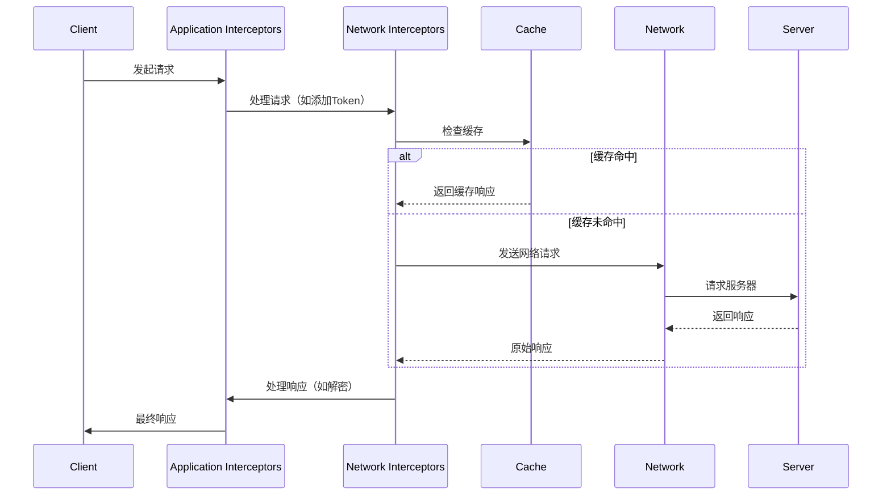
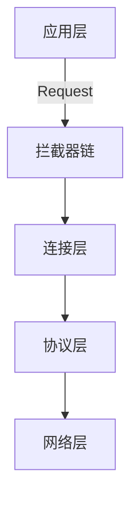
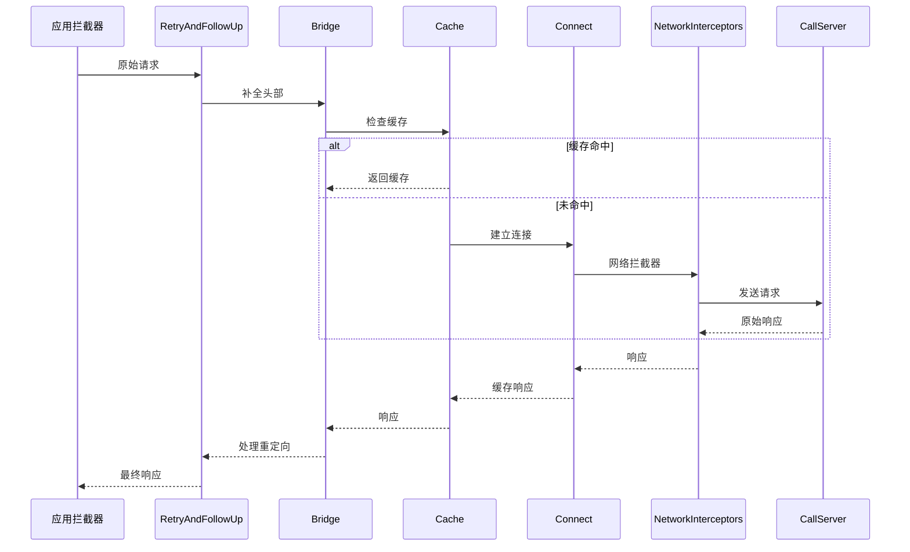

### **OkHttp 拦截器（Interceptor）原理详解**

OkHttp 的拦截器是其核心设计之一，通过 **责任链模式** 实现网络请求的模块化处理，开发者可以灵活地监控、修改请求和响应。以下是其工作原理和关键实现机制：

---

#### **一、拦截器的作用**
1. **请求预处理**：修改请求头、添加参数、加密数据。
2. **响应处理**：解压数据、缓存处理、错误重试。
3. **监控统计**：记录请求耗时、日志打印。

---

#### **二、拦截器的工作流程**
OkHttp 的拦截器分为 **应用拦截器（Application Interceptors）** 和 **网络拦截器（Network Interceptors）**，整体流程如下：



---

#### **三、拦截器责任链实现**
OkHttp 通过 `RealInterceptorChain` 类实现责任链的传递，核心逻辑如下：

##### **1. 拦截器接口定义**
```java
public interface Interceptor {
    Response intercept(Chain chain) throws IOException;
}
```

##### **2. 责任链调用（关键源码）**
```java
// RealInterceptorChain.java
public Response proceed(Request request) throws IOException {
    // 1. 获取当前拦截器
    Interceptor interceptor = interceptors.get(index);
    // 2. 创建下一个责任链节点
    RealInterceptorChain next = new RealInterceptorChain(interceptors, index + 1);
    // 3. 执行当前拦截器并传递责任链
    Response response = interceptor.intercept(next);
    return response;
}
```

##### **3. 内置拦截器示例**
| **拦截器**               | **作用**                                                                 |
|--------------------------|-------------------------------------------------------------------------|
| `RetryAndFollowUpInterceptor` | 处理重定向和失败重试。                                                   |
| `BridgeInterceptor`      | 补全请求头（如 `Content-Type`、`Cookie`）。                              |
| `CacheInterceptor`       | 缓存管理（根据 `Cache-Control` 判断是否使用缓存）。                       |
| `ConnectInterceptor`     | 建立 TCP/TLS 连接。                                                     |
| `CallServerInterceptor`  | 最终发送请求并读取响应。                                                 |

---

#### **四、自定义拦截器示例**
##### **1. 日志拦截器**
```kotlin
class LoggingInterceptor : Interceptor {
    override fun intercept(chain: Interceptor.Chain): Response {
        val request = chain.request()
        println("Request: ${request.url}")
        
        val startTime = System.nanoTime()
        val response = chain.proceed(request)
        val duration = (System.nanoTime() - startTime) / 1e6

        println("Response: ${response.code} in ${duration}ms")
        return response
    }
}
```

##### **2. Token 自动添加拦截器**
```kotlin
class AuthInterceptor : Interceptor {
    override fun intercept(chain: Interceptor.Chain): Response {
        val originalRequest = chain.request()
        val newRequest = originalRequest.newBuilder()
            .header("Authorization", "Bearer ${getToken()}")
            .build()
        return chain.proceed(newRequest)
    }
}
```

##### **3. 注册拦截器**
```kotlin
val client = OkHttpClient.Builder()
    .addInterceptor(LoggingInterceptor()) // 应用拦截器
    .addNetworkInterceptor(AuthInterceptor()) // 网络拦截器
    .build()
```

---

#### **五、应用拦截器 vs 网络拦截器**
| **特性**                | **应用拦截器**                          | **网络拦截器**                          |
|-------------------------|---------------------------------------|----------------------------------------|
| **添加方式**            | `addInterceptor()`                    | `addNetworkInterceptor()`              |
| **调用时机**            | 最早执行，即使命中缓存也会触发。         | 仅在发起网络请求时触发（缓存命中时不执行）。 |
| **可见数据**            | 原始请求和最终响应。                    | 包含网络层细节（如重定向后的请求头）。     |
| **适用场景**            | 日志、全局参数添加。                    | 网络层监控、压缩/解压。                  |

---

#### **六、高级特性**
##### **1. 修改请求/响应体**
由于 RequestBody 和 ResponseBody 是单向流，需通过 `BufferedSource` 读取并重新构建：
```kotlin
class DecryptInterceptor : Interceptor {
    override fun intercept(chain: Interceptor.Chain): Response {
        val response = chain.proceed(chain.request())
        val encryptedData = response.body?.source()?.readByteString()
        val decryptedData = decrypt(encryptedData) // 自定义解密
        return response.newBuilder()
            .body(decryptedData.toResponseBody())
            .build()
    }
}
```

##### **2. 短路请求**
在拦截器中直接返回响应，不调用 `chain.proceed()`：
```kotlin
class MockInterceptor : Interceptor {
    override fun intercept(chain: Interceptor.Chain): Response {
        if (isMockMode) {
            return Response.Builder()
                .request(chain.request())
                .protocol(Protocol.HTTP_2)
                .code(200)
                .body("{\"data\":\"mocked\"}".toResponseBody())
                .build()
        }
        return chain.proceed(chain.request())
    }
}
```

---

#### **七、性能注意事项**
1. **避免阻塞操作**：拦截器中不要执行耗时任务（如数据库读写）。
2. **复用对象**：多次修改请求时，复用 `Request.Builder` 减少内存分配。
3. **缓存处理**：网络拦截器中修改的请求可能影响缓存键，需谨慎操作。

---

#### **八、总结**
- **设计模式**：责任链模式实现模块化处理。
- **核心方法**：`intercept(Chain chain)` 和 `chain.proceed()`。
- **应用场景**：日志、认证、加密、Mock 数据、性能监控等。
- **选择策略**：  
  - 需要全局处理 → 应用拦截器  
  - 需要网络层细节 → 网络拦截器  

通过拦截器，OkHttp 实现了高度可定制的网络请求流程，这是其相比其他网络库的核心优势之一。


### **OkHttp 核心原理深度解析**

OkHttp 是 Android 和 Java 平台的高性能 HTTP 客户端，其设计融合了 **连接池复用、拦截器链、协议协商** 等优化思想。以下是其核心工作原理的体系化拆解：

---

#### **一、整体架构分层**


---

#### **二、核心组件协同流程**
##### **1. 请求发起阶段**
```java
OkHttpClient client = new OkHttpClient();
Request request = new Request.Builder().url("https://api.example.com").build();
Call call = client.newCall(request);
call.enqueue(new Callback() { ... });
```
- **Call 封装**：每个请求被封装为 `RealCall` 对象，维护请求状态（如已取消）。
- **任务调度**：通过 `Dispatcher` 管理异步请求的线程池和同步请求队列。

##### **2. 拦截器责任链处理**
OkHttp 的核心处理流程通过 **5大内置拦截器 + 自定义拦截器** 完成：


##### **3. 连接复用机制**
- **连接池（ConnectionPool）**：默认维护 5 个空闲连接，存活时间 5 分钟。
- **复用判断条件**：
  - 相同主机和端口
  - 相同的 TLS 配置
  - 连接未关闭
- **优势**：减少 TCP/TLS 握手开销，提升吞吐量。

##### **4. 协议支持与自动选择**
- **支持协议**：HTTP/1.1、HTTP/2、QUIC（实验性）。
- **协商过程**：
  1. 首次连接尝试 HTTP/2（如果服务器支持 ALPN）。
  2. 失败后降级到 HTTP/1.1。

---

#### **三、关键源码解析**
##### **1. 连接建立（ConnectInterceptor）**
```java
// 从连接池获取或新建连接
RealConnection connection = connectionPool.transmitter.acquireConnection(
    eventListener, transmitter.timeout);
```

##### **2. 请求发送（CallServerInterceptor）**
```java
// 写入请求头
httpCodec.writeRequestHeaders(request);

// 发送请求体（如有）
if (HttpMethod.permitsRequestBody(request.method())) {
    BufferedSink bufferedRequestBody = Okio.buffer(
        httpCodec.createRequestBody(request, contentLength));
    requestBody.writeTo(bufferedRequestBody);
}

// 读取响应
response = httpCodec.readResponseHeaders(false);
```

##### **3. 响应缓存（CacheInterceptor）**
```java
// 检查缓存
Response cacheCandidate = cache != null ? cache.get(chain.request()) : null;

// 根据Cache-Control决定是否使用缓存
if (cacheResponse != null) {
    return cacheResponse.newBuilder()
        .cacheResponse(stripBody(cacheResponse))
        .build();
}
```

---

#### **四、性能优化设计**
| **优化点**          | **实现方式**                                                                 |
|---------------------|-----------------------------------------------------------------------------|
| **连接复用**        | 基于 Host 的连接池管理，支持 HTTP/2 多路复用。                               |
| **请求压缩**        | 自动添加 `Accept-Encoding: gzip`，响应体自动解压。                           |
| **零拷贝优化**      | 使用 Okio 的 `BufferedSource` 减少内存拷贝。                                 |
| **DNS 优化**        | 支持自定义 Dns 实现（如 HTTPDNS）。                                          |
| **超时控制**        | 分级别设置连接、读取、写入超时。                                             |

---

#### **五、异常处理机制**
- **网络异常**：通过 `RetryAndFollowUpInterceptor` 实现自动重试（默认最大 20 次）。
- **证书校验**：`CertificatePinner` 防止中间人攻击。
- **代理支持**：自动识别系统代理设置。

---

#### **六、与其它组件对比**
| **特性**         | **OkHttp**                  | **HttpURLConnection**       | **Volley**               |
|------------------|----------------------------|----------------------------|--------------------------|
| **连接复用**     | ✅ 支持                     | ❌ 部分支持                 | ✅ 支持                  |
| **HTTP/2**       | ✅ 完整支持                 | ❌ 不支持                   | ❌ 不支持                |
| **拦截器**       | ✅ 灵活扩展                 | ❌ 无                       | ❌ 无                    |
| **缓存控制**     | ✅ 精细管理                 | ✅ 基础支持                 | ✅ 自动缓存              |

---

#### **七、最佳实践示例**
##### **1. 全局单例优化**
```java
// 共享连接池和线程池
public class OkHttpSingleton {
    private static final OkHttpClient instance = new OkHttpClient.Builder()
        .connectionPool(new ConnectionPool(10, 5, TimeUnit.MINUTES))
        .build();
    
    public static OkHttpClient getInstance() { 
        return instance; 
    }
}
```

##### **2. 文件下载进度监控**
```kotlin
val client = OkHttpClient.Builder()
    .addNetworkInterceptor(ProgressInterceptor { bytesRead, contentLength ->
        val percent = bytesRead * 100f / contentLength
        println("下载进度: ${"%.1f".format(percent)}%")
    })
    .build()
```

---

#### **八、设计思想总结**
1. **分层设计**：各司其职的拦截器链。
2. **资源复用**：连接池、线程池优化。
3. **协议透明**：自动选择最佳传输协议。
4. **扩展性**：拦截器机制支持功能插件化。

OkHttp 通过上述设计实现了 **高性能、低延迟、高可靠性** 的网络通信，成为 Android 开发的事实标准网络库。