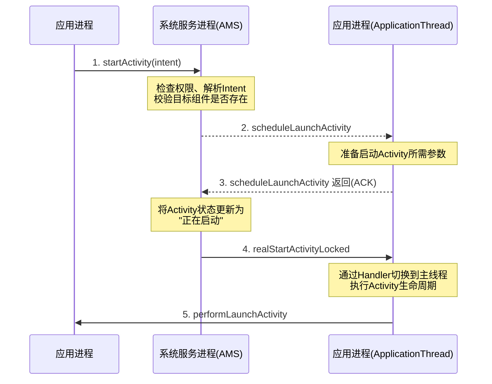
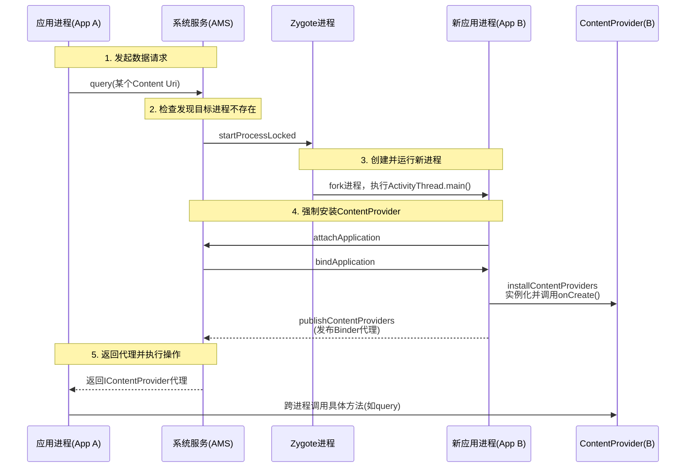

### 6月1日（周一）Day 8
| 时段 | 任务 | 产出 |
|------|------|------|
ANR 原理 | Input 5s / Broadcast 10s / Service 20s | 能说出每种场景的触发条件 |

以下是基于 `startActivity` 到 AMS 再到 ApplicationThread 核心流程的 **5 步简化时序图**：

**关键说明：**
1. **第1步**：应用进程调用 `startActivity`，通过Binder通信传递到系统服务进程的AMS。
2. **第2-3步**：AMS校验通过后，向应用进程的 `ApplicationThread` 发送启动指令并等待应答。
3. **第4步**：AMS确认应用进程就绪后，发送实际启动指令。
4. **第5步**：应用进程通过 `ActivityThread` 执行类加载、生命周期回调（`onCreate`/`onStart`/`onResume`）。

这是Android 10之前的主流流程，Android 12+引入了 `ActivityStarter` 等中间层，但核心逻辑不变。需要细化某个步骤的代码级解释吗？

你的记忆没错，`ContentProvider` 确实和 `Activity` 的启动流程有关，但它更多时候扮演的是 **“幕后支持者”** 的角色，而不是核心流程的参与者。

具体来说，它通常出现在两种关键场景中：

---

### 场景一：跨进程调用触发（最常见的关联）

这种情况是指你的 App 通过 `ContentResolver` 去访问另一个 App（或进程）中的数据。AMS (ActivityManagerService) 会介入，完成以下工作：

1.  **AMS 检查**：发现目标 `ContentProvider` 所在的进程尚未启动。
2.  **主动启动进程**：AMS 命令 Zygote 进程创建新进程，并引导其启动（即运行 `ActivityThread` 主入口）。
3.  **强制安装 Provider**：新进程启动后，会立即执行 `installContentProviders`。系统会遍历清单文件中配置的 `ContentProvider`，依次创建其实例并调用 `onCreate()`。
4.  **返回结果**：等这一切就绪后，再将 `Provider` 的代理对象通过 Binder 返回给调用方，从而完成 `query` 等操作。

**关键点**：在这种情况下，`ContentProvider` 的生命周期（`onCreate`）比它所在进程的 `Application.onCreate()` 还要早。

### 场景二：应用冷启动（间接相关）

当用户点击桌面图标启动 App 时，`ContentProvider` 依然是“伴随者”。

-   **流程**：系统在创建应用进程后，在执行 `Activity` 生命周期（`onCreate`）之前，会先检查清单文件。
-   **动作**：如果应用配置了 `ContentProvider`（例如 `FileProvider`），AMS 会强制在当前进程同步安装并启动这些 `Provider`。
-   **影响**：这解释了为什么三方 SDK（如 Glide、PhotoPicker）常利用空 `Provider` 实现自动初始化，因为这会让初始化代码在 `Application` 甚至入口 `Activity` 之前执行。

---

### 修正关于“5步时序图”的描述

结合 `ContentProvider` 的角色，我们之前讨论的 **5步简化时序图** 实际上描述的是一个 **“单进程、无需初始化额外数据源”** 的理想情况。

在真实的复杂场景（如涉及数据提供）下，流程会更长。你可以参考这张结合了 `ContentProvider` 启动细节的补充时序图：

**总结来说**：
`ContentProvider` 并不在 `startActivity` 的核心路径上，但它是一个重要的“**初始化触发器**”或“**前置依赖**”。无论是在启动 Activity 之前，还是在跨进程访问数据时，它的启动优先级都非常高（高于 Application）。

需要我为你详细拆解一下 `ContentProvider` 具体的 `onCreate` 初始化过程，或者它在 `Application` 之前的执行细节吗？