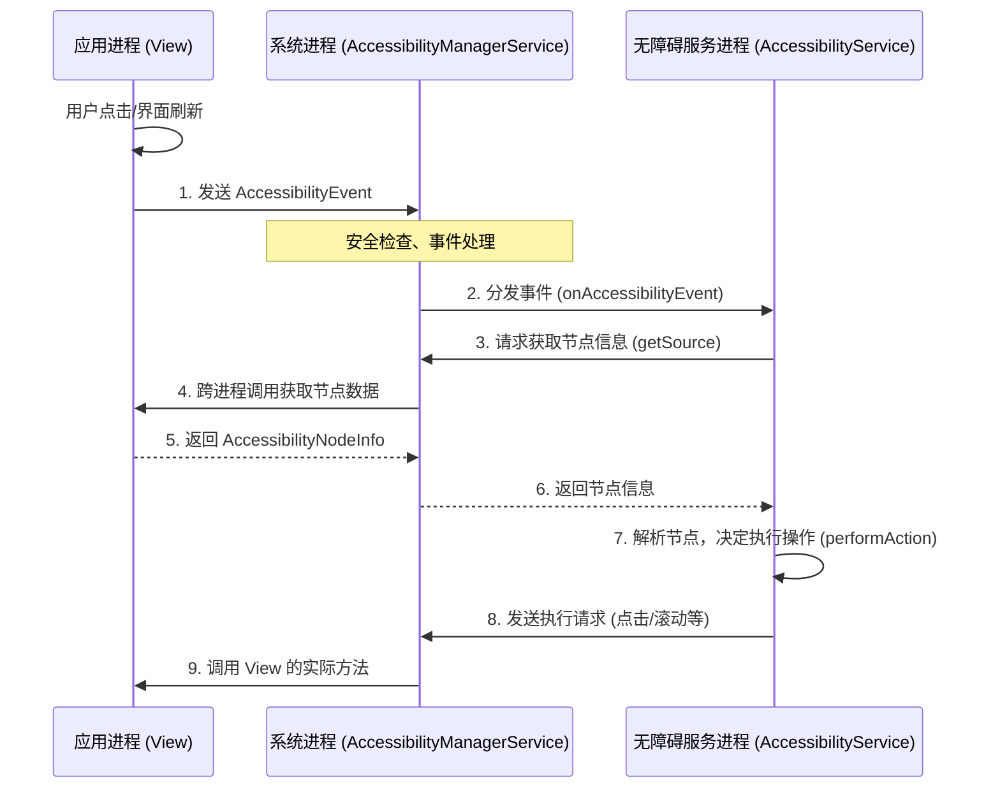

### 6月5日-6日（周末）Day 12-13
| 时段 | 任务 | 产出 |

Android 的无障碍功能（Accessibility）

Android 的无障碍功能（Accessibility）是一个典型的**C/S（客户端-服务器）架构**，运行在 `system_server` 进程中。它的核心思想是：**将界面中的 `View` 对象，转换成一种名为 `AccessibilityNodeInfo` 的结构化数据，然后跨进程传递给安装的 `AccessibilityService`**。

下面从 Framework 层开始，拆解其核心的三个层次：**事件源**、**中枢系统**和**服务端**。

### 1. 事件源：从 View 树到虚拟节点树

一切始于界面上的 `View`。

*   **信息的载体**：`View` 对象本身无法直接跨进程传输。当开启无障碍服务时，每个 `View` 都会将自己的信息（如类名、文本、位置、是否可点击等）“转换”成一个 `AccessibilityNodeInfo` 对象。这相当于在原有的 UI 视图树（View Tree）之外，建立了一棵并行的**虚拟节点树（Node Tree）**。
*   **事件的发起**：当用户交互（如焦点变化、点击、文本变更）发生，或 `View` 主动发出通知时，`View` 会调用 `sendAccessibilityEvent` 方法，产生一个 `AccessibilityEvent` 对象。这个事件包含了事件类型（如 `TYPE_VIEW_CLICKED`）和当前窗口的 ID 等信息。

### 2. 中枢系统：AccessibilityManagerService (AMS)

Framework 层的核心枢纽是 `AccessibilityManagerService`（简称 AMS），它运行在系统进程 `system_server` 中，是整个无障碍架构的“交通警察”和“安全网关”。

AMS 主要承担三大职责：

1.  **集中转发**：它接收从各个应用进程发来的 `AccessibilityEvent`，然后负责将这些事件分发给所有已开启并注册了对应事件类型的 `AccessibilityService`。
2.  **安全管理**：这是至关重要的安全环节。为了防止恶意软件窃取屏幕内容，AMS 执行严格的权限检查。例如，一个服务能否获取窗口内容、能否执行全局操作，都由 AMS 依据其配置和权限（`BIND_ACCESSIBILITY_SERVICE`）进行裁决。
3.  **生命周期管理**：它负责绑定、启动或停止用户开启的无障碍服务。

### 3. 服务端：AccessibilityService

这是开发者接触最多的层面。`AccessibilityService` 是一个运行在独立进程中的特殊服务（继承自 `Service`）。

它的工作流程如下：
*   **注册与绑定**：必须在 `AndroidManifest.xml` 中声明 `BIND_ACCESSIBILITY_SERVICE` 权限，并配置 `meta-data` 来指定它监听的事件类型。用户开启后，AMS 会绑定该服务。
*   **接收事件**：当 AMS 转发事件过来时，`onAccessibilityEvent` 回调被触发。
*   **主动交互**：为了获取更详细的界面信息，服务可以通过 `event.getSource()` 获取事件的源节点 `AccessibilityNodeInfo`。拿到这个根节点后，服务可以遍历整个窗口的 UI 树，按文本或 ID 查找特定节点。
*   **执行操作**：找到节点后，服务可以调用 `performAction`，请求 AMS 对这个节点执行点击、滚动、设置文本等操作。

下图直观地展示了这一完整的跨进程交互流程：

### 总结

总体而言，这套设计实现了**接口隔离**与**安全管控**：`AccessibilityService` 无法直接访问应用内存，只能通过 AMS 获取 AMS 授权提供的、脱敏或受限的 `AccessibilityNodeInfo` 数据；同时，`View` 不关心谁来使用，只需发出事件即可。

> 为了更聚焦于底层原理，这里没有展开应用层的开发实践。如果你想了解应用层如何基于这一原理，通过 `AccessibilityDelegate` 自定义节点信息或实现全局热区放大等具体功能，我可以继续为你介绍。