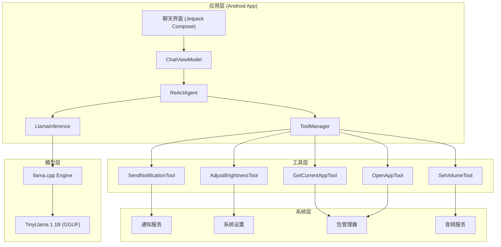
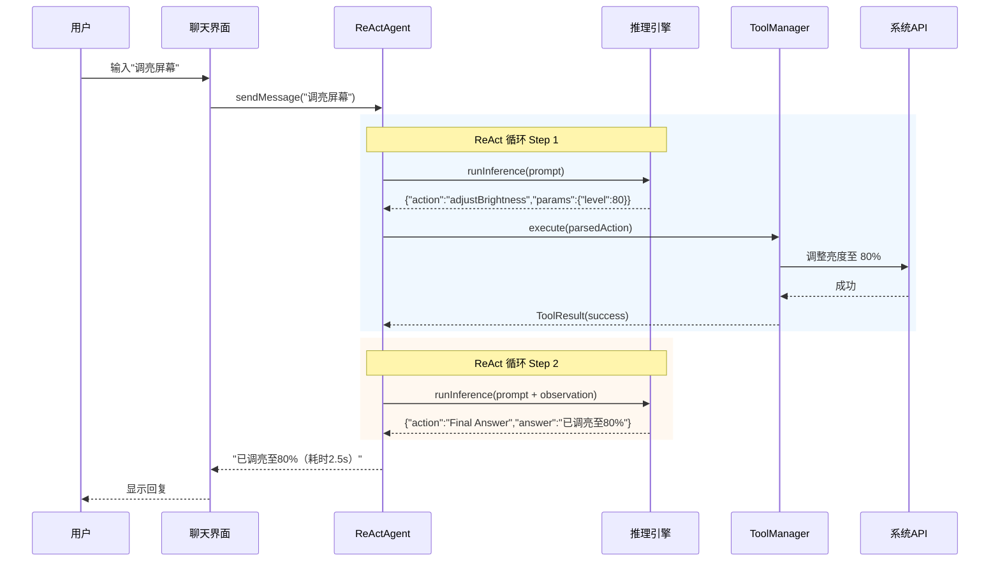

### 7月11日（周六）Day 47 — 文档周：架构图 + README
| 时段 | 任务 | 产出 |
|:---|:---|:---|
| 2h | **画架构图 + 流程图**：Agent 系统架构图、用户交互流程图（draw.io） | 2 张图（SVG/PNG） |
| 1h | 放入 GitHub 仓库 `docs/` 目录 | 仓库更新 |
| 1h | **写 README**：项目简介 + 架构图 + 技术栈 + 效果演示 | README 初版 |
| 2h | README 完善 + 写 BUILD.md：详细编译运行步骤 | README + BUILD.md 完成 |

**产出物**：架构图 + 流程图 + README + BUILD.md

---

## 一、架构图设计

### 使用工具：draw.io (推荐)

```bash
# 方式一：在线工具（推荐）
# 打开 https://app.diagrams.net/
# 选择 "保存到设备" → 后续导出 SVG

# 方式二：VS Code 插件
# 搜索 "Draw.io Integration" 插件安装
# 新建 .drawio 文件
```

### 系统架构图内容



### 交互流程图内容



### 导出与命名

```bash
# 导出文件
# SVG 格式（推荐，GitHub 支持渲染）
架构图.svg → docs/architecture.svg
流程图.svg → docs/interaction-flow.svg
```

---

## 二、README 模板

```markdown
# Android AI Agent Demo

[](LICENSE)
[](https://kotlinlang.org/)
[](https://developer.android.com/)

> 一个在 Android 端侧运行的 AI Agent Demo，通过自然语言调用手机系统能力。

## 📱 效果演示

[](链接替换为你的视频地址)


## 🏗️ 系统架构


## ✨ 功能

- ✅ **端侧 LLM 推理**：基于 llama.cpp 集成 TinyLlama 1.1B 模型
- ✅ **系统工具调用**：支持 5+ 系统 API 调用
- ✅ **ReAct 循环**：支持多步任务规划和执行
- ✅ **多轮对话**：保持对话上下文
- ✅ **错误处理**：自动重试、降级提示

### 支持的工具

| 工具 | 说明 | 示例 |
|:---|:---|:---|
| `sendNotification` | 发送系统通知 | "发通知说：写完了" |
| `adjustBrightness` | 调整屏幕亮度 | "调亮屏幕到 80%" |
| `getCurrentApp` | 获取前台应用 | "当前在哪个 App？" |
| `setVolume` | 调整媒体音量 | "音量调到 70" |
| `openApp` | 打开指定应用 | "打开微信" |

## 🔧 技术栈

- **语言**：Kotlin + Jetpack Compose
- **推理引擎**：llama.cpp (C++ JNI)
- **模型**：TinyLlama-1.1B-Chat (GGUF Q4_K_M)
- **架构**：MVVM (ViewModel + StateFlow)
- **构建**：CMake + NDK

## 📦 环境要求

| 环境 | 版本 |
|:---|:---|
| Android Studio | Hedgehog (2023.1.1+) |
| NDK | r26+ |
| CMake | 3.18+ |
| Gradle | 8.2+ |
| 手机 | ARM64, 6GB+ RAM |

## 🚀 快速开始

### 1. 下载模型

```bash
# 从 Hugging Face 下载 Q4 量化模型
wget https://huggingface.co/TheBloke/TinyLlama-1.1B-Chat-v1.0-GGUF/resolve/main/tinyllama-1.1b-chat-v1.0.Q4_K_M.gguf

# 放入 assets 目录
cp tinyllama-1.1b-chat-v1.0.Q4_K_M.gguf app/src/main/assets/
```

### 2. 编译运行

```bash
# 克隆仓库
git clone https://github.com/yourusername/AndroidAgentDemo.git

# 打开 Android Studio 打开此目录
# Sync Gradle → 等待构建完成

# 手动编译
./gradlew assembleDebug

# 安装到手机
adb install -r app/build/outputs/apk/debug/app-debug.apk
```

### 3. 使用

1. 打开 App，等待模型加载（首次约 10-20 秒）
2. 在输入框输入指令并发送
3. 等待 Agent 执行并回复

## 📚 项目结构

```
app/
├── src/main/
│   ├── java/com/example/androidagent/
│   │   ├── MainActivity.kt          # 入口
│   │   ├── MyApplication.kt         # Application 初始化
│   │   ├── agent/
│   │   │   ├── ReActAgent.kt        # ReAct 循环核心
│   │   │   └── ConversationManager.kt # 对话上下文
│   │   ├── inference/
│   │   │   └── LlamaInference.kt    # 推理封装
│   │   └── tool/
│   │       ├── AgentTool.kt         # 工具接口
│   │       ├── ToolManager.kt       # 工具管理器
│   │       ├── JsonActionParser.kt  # JSON 解析器
│   │       └── impl/                # 工具实现
│   ├── jni/                         # JNI 桥接代码
│   ├── cpp/                         # llama.cpp 核心
│   └── assets/                      # 模型文件
└── docs/                            # 文档
    ├── architecture.svg
    └── interaction-flow.svg
```

## ⚡ 性能数据

| 测试项 | 数据 |
|:---|:---|
| 模型大小 | ~410 MB (Q4_K_M) |
| 模型加载时间 | ~3s |
| 单步推理耗时 | ~2.5s |
| 多步任务耗时 | ~5s (2 步) |
| 峰值内存占用 | ~500 MB |

## 🗺️ 路线图

- [ ] 更多工具：截图、壁纸、剪贴板
- [ ] 更小的模型：Qwen2.5-0.5B
- [ ] 语音输入
- [ ] 自定义 Tool 注册 API

## 📄 License

MIT License
```

---

## 三、BUILD.md 模板

```markdown
# Build Guide — Android Agent Demo

## 前置环境

### 1. Android Studio

从 [developer.android.com/studio](https://developer.android.com/studio) 下载安装。

### 2. NDK

```
Settings → Appearance & Behavior → System Settings → Android SDK → SDK Tools
→ 勾选 NDK (Side by side) → Apply
推荐版本: 26.1.10909125
```

验证安装：

```bash
# Windows
echo %ANDROID_NDK_HOME%
# 输出 C:\Users\xxx\AppData\Local\Android\Sdk\ndk\26.1.10909125

ndk-build --version
# GNU Make 4.2.1
```

### 3. 模型文件

Hugging Face 下载 TinyLlama-1.1B-Chat-v1.0 Q4_K_M GGUF：

```bash
wget https://huggingface.co/TheBloke/TinyLlama-1.1B-Chat-v1.0-GGUF/resolve/main/tinyllama-1.1b-chat-v1.0.Q4_K_M.gguf
```

## 编译步骤

### Step 1: Clone 仓库

```bash
git clone git@github.com:yourusername/AndroidAgentDemo.git
cd AndroidAgentDemo
```

### Step 2: 放入模型

```bash
mkdir -p app/src/main/assets
cp /path/to/tinyllama-1.1b-chat-v1.0.Q4_K_M.gguf app/src/main/assets/
```

### Step 3: Gradle 同步

用 Android Studio 打开项目根目录，等待 Gradle Sync 完成。

或者命令行同步：

```bash
./gradlew --refresh-dependencies
```

### Step 4: 编译

```bash
# Debug 版（推荐）
./gradlew assembleDebug

# Release 版
./gradlew assembleRelease
```

### Step 5: 安装

```bash
# USB 调试已开启
adb devices
# 确认设备已连接

adb install -r app/build/outputs/apk/debug/app-debug.apk
```

### Step 6: 运行

在手机上找到 "AndroidAgent" App 图标，点击打开。

**首次启动**（约 10-20 秒）：
- 模型文件从 assets 解压到内部存储
- 模型加载到内存
- 看到 "Agent 已就绪" 提示 → 可开始使用

## 常见编译问题

```
问题: AAPT2 error: file not found
解决: File → Invalidate Caches → Restart

问题: CMake was unable to find a build program
解决: 确保 CMake 已安装（SDK Manager → SDK Tools → CMake）

问题: No toolchain for ABI arm64-v8a
解决: 升级 NDK 到 r26+

问题: UnsatisfiedLinkError: dlopen failed
解决: 确认 JNI 库已编译成功（查看 Build Output 中的 LLVM 编译日志）
```

## 目录结构（编译后）

```
app/build/
├── outputs/apk/debug/
│   └── app-debug.apk          ← 安装包
├── intermediates/
│   └── cmake/debug/obj/
│       └── arm64-v8a/
│           └── libllama-android.so  ← 原生库
└── ...
```
"""

---

## 产出物确认

- [x] 架构图（architecture.svg）：展示 Agent 整体分层结构
- [x] 交互流程图（interaction-flow.svg）：展示 ReAct 循环时序
- [x] README.md：项目简介、架构图、功能列表、快速开始、项目结构、性能数据
- [x] BUILD.md：前置环境、编译步骤、常见问题、目录结构
