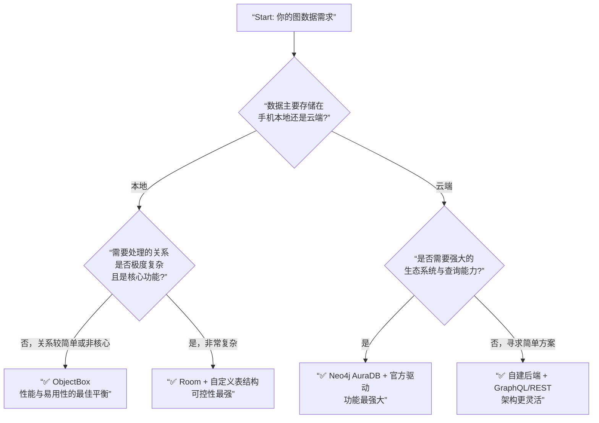

好的，这是一个非常技术性的问题。答案是：**是的，Android 有类似图数据库的解决方案，但需要根据你的具体需求来选择。**

简单来说，图数据库是一种使用图结构（节点、边、属性）进行语义查询的数据库，它特别擅长处理复杂的关系查询。

下面我为你详细解析 Android 上的几种选择：

---

### 一、纯 Android 原生/本地图数据库

这类数据库可以直接在你的 App 中集成，数据存储在设备本地。

#### 1. **Neo4j AuraDB* (官方云服务，但客户端可用于 Android)**
   - **简介**：Neo4j 是最著名的图数据库，但其原生版本是 Java 服务端应用。
   - **在 Android 上的用法**：
     - **使用官方驱动**：Neo4j 提供了 Java 驱动程序，可以在 Android 上通过它与远端的 **Neo4j AuraDB**（云托管版）或自建服务器进行通信。这本质上是 **客户端-服务器** 模式，不是纯本地数据库。
     - **优点**：功能强大，Cypher 查询语言表达能力强，社区成熟。
     - **缺点**：**不是纯本地数据库**，需要网络连接，依赖后端服务。

#### 2. **ObjectBox (推荐)**
   - **简介**：ObjectBox 是一个超快的本地 NoSQL 数据库，它有一个非常重要的特性——**原生支持关系查询**。
   - **为什么它“类似”图数据库**：
     - 它允许你非常高效地遍历对象之间的关系（如一对多、多对多）。
     - 虽然它的查询语言不是 Cypher，但其 `Relation` 和 `Backlink` 注解使得处理复杂关系变得非常简单和快速，能满足很多图状数据的查询需求。
     - **优点**：**极快的速度**、简单的 API、低功耗、纯本地、无依赖。
     - **缺点**：不是标准的属性图模型，不能使用 Cypher 查询。

#### 3. **Room + 自定义关系管理**
   - **简介**：Room 是 Google 官方推荐的 SQLite 抽象层。
   - **如何模拟图数据库**：
     - 你可以用两张表分别表示 `Node` 和 `Relationship`。
     - 通过编写复杂的 SQL 查询（如 `JOIN`）来模拟图的遍历。
     - **优点**：官方支持，与 Android Jetpack 组件无缝集成。
     - **缺点**：**工作量大**，需要自己设计表结构和查询。当关系变得非常复杂时，SQL 查询会变得极其复杂和低效。**不推荐用于复杂的图数据场景**。

#### 4. **SQLite with R-Tree 或 GOSH (Graph-Oriented SQLite Helper)**
   - **简介**：SQLite 本身支持 `WITH RECURSIVE` 语句，可以执行有限的递归查询（用于遍历图）。
   - **GOSH**：一个开源库，它在 SQLite 之上提供了一个简单的图抽象层。
   - **优点**：无需引入新依赖，基于最稳定的 SQLite。
   - **缺点**：性能和易用性不如专门的图数据库。

---

### 二、基于云的图数据库（通过 API 访问）

如果你的数据主要在云端，或者需要多设备同步，这是更好的选择。

1.  **Neo4j AuraDB**：如上所述，通过其 REST API 或 Java 驱动在 Android 客户端进行访问。
2.  **Amazon Neptune**：AWS 的托管图数据库服务。
3.  **Azure Cosmos DB**：支持 Gremlin API 的图数据库。

**这种模式的优缺点**：
- **优点**：数据可跨设备同步，计算在云端，不消耗手机资源。
- **缺点**：**必须联网**，有网络延迟，通常按使用量收费。

---

### 总结与选择建议

为了帮你快速做出选择，可以参考下面的决策流程图：

**根据你的场景，我的建议是：**

- **对于大多数移动端应用**：**ObjectBox** 是最佳选择。它在处理关系方面非常高效，能覆盖90%的图状数据需求，且无需网络，体验最佳。
- **如果你的应用核心功能就是复杂的图分析**（例如社交网络分析、推荐系统），且数据量很大：建议使用 **云端 Neo4j + Android 客户端** 的模式，将复杂的图计算放在服务器上。
- **如果你只是想存储一些用户本地的、简单的关系数据**：用 **Room** 自己设计表结构就足够了。

**最终建议：**
先从 **ObjectBox** 开始评估，它很可能是最能满足你需求的“Android 上的图数据库”。