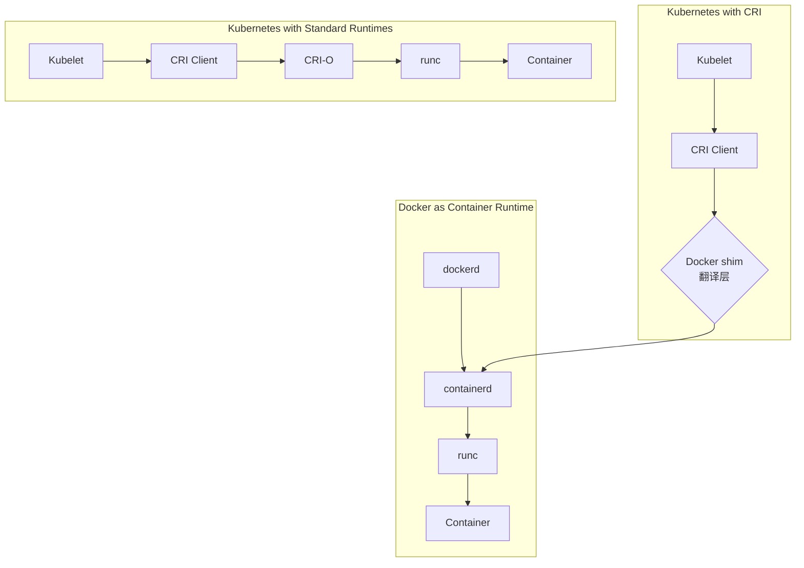

好的，这是一个非常重要且常见的问题。简单来说，Kubernetes 不推荐使用 Docker 的根本原因在于 **架构上的冗余和标准的不统一**。

下面我们通过一个比喻和详细的技术解释来理解这个问题。

### 一句话总结

Kubernetes 不再需要 Docker 这个完整的“全家桶”，它只需要其中符合标准的“发动机”——**容器运行时**。Docker 提供的其他工具对于 K8s 来说是多余的。

---

### 一个简单的比喻

把部署应用想象成造车和建公路：

*   **Docker**：像一个**完整的汽车制造厂**。它不仅能生产发动机（容器运行时），还生产车身、方向盘、轮胎（镜像构建、网络、存储、CLI工具等）。它出厂的是一辆完整的、可以直接上路的汽车。
*   **Kubernetes**：像一个**高度智能的全国公路系统**。它不关心你的车是哪个厂造的，它只关心车的**发动机必须符合一个统一的标准**，这样它才能指挥所有车辆在公路上有序、高效地行驶。

以前，Kubernetes 这个“公路系统”专门为 Docker 这家“汽车厂”修了一条入口。但现在，它决定只认“标准发动机接口”，而 Docker 的发动机外面还套着一个非标准的壳子，所以需要额外加一个适配器才能接入。

---

### 详细技术解释

为了理解这一点，我们首先需要了解 Docker 和 Kubernetes 的底层架构，下图清晰地展示了它们是如何协同工作的：

#### 1. Docker 的架构（一个“全家桶”）

Docker 本身并不是一个单一的组件，而是一个由多个部分组成的完整体系：

*   **Docker Daemon**：核心后台服务。
*   **containerd**：一个负责容器生命周期管理的工业级标准运行时。
*   **runc**：一个根据 OCI 标准真正创建和运行容器的低级工具。
*   **Docker API & CLI**：我们用来输入 `docker run` 等命令的接口。
*   **Docker 镜像构建工具**：等等。

你会发现，Docker 的底层其实已经使用了 **containerd** 和 **runc** 这两个标准组件。

#### 2. Kubernetes 的需求（只需要“发动机”）

Kubernetes 的工作节点上有一个叫 **kubelet** 的组件，它负责管理本节点上容器的创建、启动、停止等。为了与各种容器技术交互，Kubernetes 定义了一个标准接口——**容器运行时接口（CRI）**。

Kubelet 只通过 CRI 与容器运行时通信。

#### 3. 核心矛盾：Docker 不兼容 CRI

Docker 被设计成一个给人类使用的、功能丰富的完整产品，它**没有实现 CRI 接口**。

因此，在旧版本中，Kubernetes 为了能够使用 Docker，不得不维护一个额外的适配层——**`dockershim`**。这个 `dockershim` 的作用就像一个“翻译官”，它接收来自 kubelet 的 CRI 指令，然后将其翻译成 Docker API 能理解的指令，再调用 Docker Daemon。

这就导致了上图中路径 B 所示的冗长调用链：**kubelet -> dockershim -> Docker Daemon -> containerd -> runc -> Container**。

#### 4. 为什么移除 Docker？（扔掉“翻译官”）

维护 `dockershim` 给 Kubernetes 社区带来了巨大的负担：

1.  **额外的复杂性**：调用链长且复杂，出问题时难以排查。
2.  **维护负担**：Docker 的任何一个 API 变动都可能需要 `dockershim` 做出调整，这消耗了社区大量本可以用于核心功能的精力。
3.  **冗余**：Kubernetes 真正需要的是 **containerd**（或类似的 CRI 运行时），而 Docker Daemon 成了一个多余的中间层。

随着 **containerd** 和 **CRI-O** 这类**原生就实现了 CRI 接口**的运行时逐渐成熟和稳定，Kubernetes 自然决定抛弃这个沉重的包袱。

---

### 这对用户有什么影响？

**注意：这主要影响的是 Kubernetes 集群的维护者，而不是普通应用开发者。**

*   **对于 Kubernetes 管理员**：
    *   在部署新集群（v1.24 及以上版本）时，需要选择 **containerd** 或 **CRI-O** 作为容器运行时，而不是 Docker。
    *   如果你的旧集群从低版本升级上来，且之前使用 Docker，你需要进行迁移。

*   **对于应用开发者/用户**：
    *   **几乎没有影响！**
    *   你仍然可以**继续使用 Docker** 在本地**构建**和**测试**你的容器镜像。
    *   你编写 **Dockerfile** 的方式完全不变。
    *   你将镜像推送到 Docker Hub 或其他仓库的方式也完全不变。
    *   你在 Kubernetes 部署文件中使用的镜像地址也完全不变。

因为 Kubernetes 抛弃的是 Docker *运行时*，而不是 Docker *镜像格式*。OCI 标准镜像格式仍然是绝对的主流和标准。

### 总结

| 项目 | 过去 | 现在和未来 |
| :--- | :--- | :--- |
| **容器运行时** | Docker (通过 `dockershim` 适配) | **containerd**、**CRI-O**（原生 CRI） |
| **镜像构建与测试** | Docker | **Docker**、Podman、Buildah 等（一切照旧） |
| **镜像格式** | Docker 镜像格式 | **OCI 标准格式**（与Docker镜像格式兼容） |

**结论**：Kubernetes 放弃 Docker 是其迈向更加模块化、标准化和可维护架构的必然一步。它扔掉的是一个冗余的“中间商”，直接与更底层的标准运行时交互，这让整个系统更高效、更健壮。对于我们大多数人来说，以前怎么用 Docker，现在还怎么用。