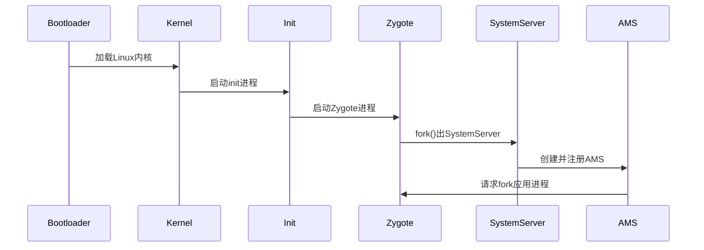

### **Android 系统启动流程：AMS 与 Zygote 的核心作用解析**

Android 系统的启动流程涉及多个关键组件，其中 **ActivityManagerService (AMS)** 和 **Zygote** 是核心枢纽。以下是它们的协作流程和原理详解：

---

#### **一、整体启动流程概览**


---

#### **二、Zygote 的核心作用**
##### **1. Zygote 的启动**
- **init.rc 触发**：由 init 进程解析启动脚本，加载 Zygote：
  ```bash
  # init.zygote64.rc
  service zygote /system/bin/app_process64 -Xzygote /system/bin --zygote --start-system-server
      class main
      socket zygote stream 660 root system
  ```
- **关键职责**：
  - **预加载资源**：类、主题、共享库等（加速后续应用启动）。
  - **Socket 监听**：通过 `/dev/socket/zygote` 接收 AMS 的进程创建请求。
  - **fork 机制**：采用 Copy-on-Write (COW) 技术快速创建新进程。

##### **2. Zygote 的工作流程**
```java
// ZygoteInit.java
public static void main(String[] argv) {
    // 1. 预加载类和资源
    preload(); 
    // 2. 启动SystemServer
    if (argv[1].equals("--start-system-server")) {
        forkSystemServer();
    }
    // 3. 进入循环，监听AMS请求
    runSelectLoop();
}
```

---

#### **三、ActivityManagerService (AMS) 的核心作用**
##### **1. AMS 的创建**
- **SystemServer 初始化**：由 Zygote fork 出的 SystemServer 进程启动 AMS：
  ```java
  // SystemServer.java
  private void startBootstrapServices() {
      mActivityManagerService = new ActivityManagerService(context);
      ServiceManager.addService("activity", mActivityManagerService);
  }
  ```
- **主要功能**：
  - **应用生命周期管理**：启动、销毁、调度 Activity。
  - **进程管理**：通过 Zygote 创建应用进程。
  - **四大组件调度**：协调 Activity、Service、Broadcast、ContentProvider。

##### **2. AMS 与 Zygote 的交互**
当需要启动新应用时：
1. **AMS 发送请求**：通过 Socket 向 Zygote 传递参数（如 UID、GID、主类名）。
2. **Zygote fork 进程**：复制自身创建新进程，执行 `ActivityThread.main()`。
3. **进程初始化**：新进程加载目标 APK 的 `Application` 和 `Activity`。

```java
// ActivityManagerService.java
void startProcess(String processName, ApplicationInfo info) {
    Process.ProcessStartResult startResult = Process.start(
        "android.app.ActivityThread", 
        info.processName,
        uid, gid, 
        // 其他参数...
    );
}
```

---

#### **四、关键协作流程示例：启动一个 App**
1. **用户点击图标**：Launcher 通过 Binder 调用 AMS 的 `startActivity()`。
2. **AMS 检查权限**：验证目标 Activity 是否在 Manifest 中声明。
3. **请求 Zygote**：若目标进程不存在，AMS 通过 Socket 通知 Zygote fork 新进程。
4. **进程初始化**：新进程执行 `ActivityThread.main()`，创建 `Application` 和 `Activity`。
5. **界面显示**：AMS 通过 Binder 调度 Activity 的生命周期回调（`onCreate()`、`onResume()`）。

---

#### **五、技术亮点**
| **组件**  | **关键技术**                                                                 | **优化目的**                     |
|-----------|-----------------------------------------------------------------------------|--------------------------------|
| **Zygote** | - Copy-on-Write 进程复用<br>- 预加载公共资源                                  | 减少内存占用，加速应用启动          |
| **AMS**    | - Binder IPC 跨进程通信<br>- 进程优先级管理（OOM_ADJ）                       | 统一调度系统资源，保证流畅性         |

---

#### **六、常见问题解析**
**Q1: 为什么需要 Zygote 而不是直接 fork 新进程？**  
- **资源共享**：预加载的类库和资源可被所有应用进程共享，减少内存冗余。
- **启动速度**：COW 机制比完整创建进程快 10 倍以上。

**Q2: AMS 如何防止恶意应用无限创建进程？**  
- **进程数限制**：通过 `max_phantom_processes` 控制僵尸进程数量。
- **LRU 淘汰**：当系统内存不足时，AMS 按优先级回收旧进程。

**Q3: SystemServer 和 Zygote 的关系？**  
- **父子进程**：SystemServer 是 Zygote fork 的第一个 Java 进程。
- **分工明确**：Zygote 负责“生孩子”，SystemServer 负责“管家务”（AMS/PMS/WMS 等核心服务）。

---

#### **七、启动耗时优化**
1. **Zygote 预加载优化**：
   ```bash
   # 修改预加载列表（减少不必要的类）
   /system/etc/preloaded-classes
   ```
2. **AMS 进程调度优化**：
   ```java
   // 设置后台进程限制
   ActivityManager.setProcessLimit(4);
   ```

---

#### **八、总结**
- **Zygote**：Android 的“进程孵化器”，通过 COW 实现高效进程创建。
- **AMS**：系统的“大管家”，统一管理四大组件和进程生命周期。
- **协作关键**：基于 Socket 的进程创建请求 + Binder 的跨进程控制。

理解 AMS 和 Zygote 的协作机制，是掌握 Android 系统底层原理的重要基石。