### **Android 系统启动流程：AMS 与 Zygote 的核心作用解析**

Android 系统的启动流程涉及多个关键组件，其中 **ActivityManagerService (AMS)** 和 **Zygote** 是核心枢纽。以下是它们的协作流程和原理详解：

---

#### **一、整体启动流程概览**

```mermaid
sequenceDiagram
    participant Bootloader
    participant Kernel
    participant Init
    participant Zygote
    participant SystemServer
    participant AMS

    Bootloader->>Kernel: 加载Linux内核
    Kernel->>Init: 启动init进程
    Init->>Zygote: 启动Zygote进程
    Zygote->>SystemServer: fork()出SystemServer
    SystemServer->>AMS: 创建并注册AMS
    AMS->>Zygote: 请求fork应用进程
```


---

#### **二、Zygote 的核心作用**
##### **1. Zygote 的启动**
- **init.rc 触发**：由 init 进程解析启动脚本，加载 Zygote：
  ```bash
  # init.zygote64.rc
  service zygote /system/bin/app_process64 -Xzygote /system/bin --zygote --start-system-server
      class main
      socket zygote stream 660 root system
  ```
- **关键职责**：
  - **预加载资源**：类、主题、共享库等（加速后续应用启动）。
  - **Socket 监听**：通过 `/dev/socket/zygote` 接收 AMS 的进程创建请求。
  - **fork 机制**：采用 Copy-on-Write (COW) 技术快速创建新进程。

##### **2. Zygote 的工作流程**
```java
// ZygoteInit.java
public static void main(String[] argv) {
    // 1. 预加载类和资源
    preload(); 
    // 2. 启动SystemServer
    if (argv[1].equals("--start-system-server")) {
        forkSystemServer();
    }
    // 3. 进入循环，监听AMS请求
    runSelectLoop();
}
```

---

#### **三、ActivityManagerService (AMS) 的核心作用**
##### **1. AMS 的创建**
- **SystemServer 初始化**：由 Zygote fork 出的 SystemServer 进程启动 AMS：
  ```java
  // SystemServer.java
  private void startBootstrapServices() {
      mActivityManagerService = new ActivityManagerService(context);
      ServiceManager.addService("activity", mActivityManagerService);
  }
  ```
- **主要功能**：
  - **应用生命周期管理**：启动、销毁、调度 Activity。
  - **进程管理**：通过 Zygote 创建应用进程。
  - **四大组件调度**：协调 Activity、Service、Broadcast、ContentProvider。

##### **2. AMS 与 Zygote 的交互**
当需要启动新应用时：
1. **AMS 发送请求**：通过 Socket 向 Zygote 传递参数（如 UID、GID、主类名）。
2. **Zygote fork 进程**：复制自身创建新进程，执行 `ActivityThread.main()`。
3. **进程初始化**：新进程加载目标 APK 的 `Application` 和 `Activity`。

```java
// ActivityManagerService.java
void startProcess(String processName, ApplicationInfo info) {
    Process.ProcessStartResult startResult = Process.start(
        "android.app.ActivityThread", 
        info.processName,
        uid, gid, 
        // 其他参数...
    );
}
```

---

#### **四、关键协作流程示例：启动一个 App**
1. **用户点击图标**：Launcher 通过 Binder 调用 AMS 的 `startActivity()`。
2. **AMS 检查权限**：验证目标 Activity 是否在 Manifest 中声明。
3. **请求 Zygote**：若目标进程不存在，AMS 通过 Socket 通知 Zygote fork 新进程。
4. **进程初始化**：新进程执行 `ActivityThread.main()`，创建 `Application` 和 `Activity`。
5. **界面显示**：AMS 通过 Binder 调度 Activity 的生命周期回调（`onCreate()`、`onResume()`）。

---

#### **五、技术亮点**
| **组件**  | **关键技术**                                                                 | **优化目的**                     |
|-----------|-----------------------------------------------------------------------------|--------------------------------|
| **Zygote** | - Copy-on-Write 进程复用<br>- 预加载公共资源                                  | 减少内存占用，加速应用启动          |
| **AMS**    | - Binder IPC 跨进程通信<br>- 进程优先级管理（OOM_ADJ）                       | 统一调度系统资源，保证流畅性         |

---

#### **六、常见问题解析**
**Q1: 为什么需要 Zygote 而不是直接 fork 新进程？**  
- **资源共享**：预加载的类库和资源可被所有应用进程共享，减少内存冗余。
- **启动速度**：COW 机制比完整创建进程快 10 倍以上。

**Q2: AMS 如何防止恶意应用无限创建进程？**  
- **进程数限制**：通过 `max_phantom_processes` 控制僵尸进程数量。
- **LRU 淘汰**：当系统内存不足时，AMS 按优先级回收旧进程。

**Q3: SystemServer 和 Zygote 的关系？**  
- **父子进程**：SystemServer 是 Zygote fork 的第一个 Java 进程。
- **分工明确**：Zygote 负责“生孩子”，SystemServer 负责“管家务”（AMS/PMS/WMS 等核心服务）。

---

#### **七、启动耗时优化**
1. **Zygote 预加载优化**：
   ```bash
   # 修改预加载列表（减少不必要的类）
   /system/etc/preloaded-classes
   ```
2. **AMS 进程调度优化**：
   ```java
   // 设置后台进程限制
   ActivityManager.setProcessLimit(4);
   ```

---

#### **八、总结**
- **Zygote**：Android 的“进程孵化器”，通过 COW 实现高效进程创建。
- **AMS**：系统的“大管家”，统一管理四大组件和进程生命周期。
- **协作关键**：基于 Socket 的进程创建请求 + Binder 的跨进程控制。

理解 AMS 和 Zygote 的协作机制，是掌握 Android 系统底层原理的重要基石。


### **Android App 启动流程详解**

Android 应用的启动流程涉及多个系统组件和阶段，从用户点击图标到界面显示，整个过程可以分为以下几个关键步骤：

---

## **1. 用户点击 App 图标**
- 触发 `Launcher`（桌面应用）向 `ActivityManagerService`（AMS）发送启动请求。
- AMS 检查应用进程是否存在：
  - **如果进程不存在**：创建新进程。
  - **如果进程已存在**：直接唤醒目标 Activity。

---

## **2. 创建应用进程（Zygote 孵化）**
- **AMS 通过 Socket 通知 `Zygote` 进程**（Android 的进程孵化器）`fork()` 一个新进程。
- **新进程的入口是 `ActivityThread.main()`**，这里是应用的“主线程”（UI 线程）。
- 初始化 `Application` 和主线程的 `Looper`（消息循环）。

---

## **3. 初始化 Application**
- **调用 `Application.onCreate()`**：
  - 这是应用级别的初始化入口。
  - 通常在这里初始化全局组件（如数据库、网络库、Crash 监控等）。
- **绑定 `ContentProvider`**（如果有）：
  - `ContentProvider` 的 `onCreate()` 会在 `Application.onCreate()` **之前**调用。

---

## **4. 启动入口 Activity**
- **AMS 通过 Binder 通知 `ActivityThread` 创建目标 Activity**。
- **执行 Activity 的生命周期方法**：
  1. **`Activity` 实例化**（调用构造函数）。
  2. **`attach()`**：绑定 `Context` 和 `Window`。
  3. **`onCreate()`**：
     - 调用 `setContentView()` 加载布局。
     - 初始化 UI 和数据。
  4. **`onStart()`**：Activity 可见但未进入前台。
  5. **`onResume()`**：Activity 进入前台，可交互。

---

## **5. UI 渲染流程**
- **`ViewRootImpl` 接管 UI 渲染**：
  - `Activity` 的 `Window` 关联 `ViewRootImpl`。
  - **`performTraversals()`** 触发 `measure` → `layout` → `draw`：
    1. **Measure**：计算 View 的大小。
    2. **Layout**：确定 View 的位置。
    3. **Draw**：绘制到屏幕（通过 `SurfaceFlinger` 提交给 GPU）。

---

## **6. 最终显示**
- **`SurfaceFlinger` 合成图层**，通过 `HWComposer` 或 `GPU` 渲染到屏幕。
- 用户看到完整的 App 界面。

---

## **流程图**

```mermaid
sequenceDiagram
    participant Launcher
    participant AMS
    participant Zygote
    participant ActivityThread
    participant Application
    participant Activity

    Launcher->>AMS: startActivity(intent)
    AMS->>Zygote: fork() 新进程
    Zygote->>ActivityThread: main()
    ActivityThread->>Application: onCreate()
    ActivityThread->>Activity: attach()
    Activity->>Activity: onCreate()
    Activity->>Activity: onStart()
    Activity->>Activity: onResume()
    Activity->>ViewRootImpl: performTraversals()
    ViewRootImpl->>SurfaceFlinger: 提交帧数据
    SurfaceFlinger->>Screen: 显示界面
```


---

## **关键点总结**
1. **进程创建**：由 `Zygote` `fork()` 出应用进程，入口是 `ActivityThread.main()`。
2. **Application 初始化**：`Application.onCreate()` 是最早的回调，适合全局初始化。
3. **Activity 启动**：`onCreate()` → `onStart()` → `onResume()`。
4. **UI 渲染**：`ViewRootImpl` 负责 `measure/layout/draw`，最终由 `SurfaceFlinger` 显示。
5. **性能优化**：
   - 减少 `Application.onCreate()` 的耗时（避免主线程阻塞）。
   - 优化 `Activity` 的 `onCreate()`（延迟加载、异步加载数据）。

---

## **常见问题**
### **Q1：冷启动 vs 热启动**
- **冷启动**：进程不存在，完整走上述流程（最慢）。
- **热启动**：进程已存在，直接唤醒 Activity（跳过 `Application` 初始化）。

### **Q2：如何优化启动速度？**
- 减少 `Application` 初始化任务（使用懒加载或异步初始化）。
- 使用 `SplashScreen` API（Android 12+）避免白屏。
- 避免主线程 I/O 操作（如数据库初始化）。

### **Q3：`ContentProvider` 为什么在 `Application.onCreate()` 之前初始化？**
- 系统会在 `Application` 初始化前加载 `<application>` 中声明的 `ContentProvider`，以便其他应用能尽早访问数据。

---

掌握这些流程后，可以更高效地优化 App 启动性能！ 🚀