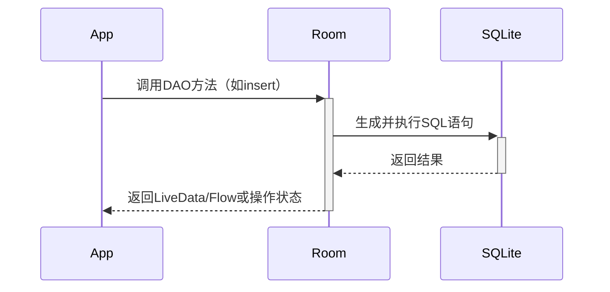

# Room 持久化库详解

## 一、Room 的本质与优势

Room 是 Android Jetpack 中的 **SQLite 抽象层**，通过注解和编译时检查，提供更安全、高效的数据库访问方式。

### 核心优势

| 特性 | 说明 |
|------|------|
| 编译时校验 | SQL 语句在编译时检查语法和表结构，避免运行时崩溃 |
| 简化样板代码 | 自动生成 DAO（数据访问对象）实现类，减少手写 SQLite 代码量 |
| LiveData/Flow 集成 | 支持返回 LiveData 或 Flow，实现数据变更自动通知 UI |
| 协程支持 | 原生支持 Kotlin 协程，简化异步操作 |

---

## 二、Room 核心组件

### 1. Entity（数据表）

定义数据库表结构：

```kotlin
@Entity(tableName = "users")
data class User(
    @PrimaryKey(autoGenerate = true) val id: Int = 0,
    @ColumnInfo(name = "user_name") val name: String,
    @ColumnInfo(defaultValue = "18") val age: Int
)
```

- `@Entity`：标记为数据表
- `@PrimaryKey`：主键（支持自增）
- `@ColumnInfo`：自定义列名/默认值

### 2. DAO（数据访问对象）

定义数据库操作接口：

```kotlin
@Dao
interface UserDao {
    @Insert
    suspend fun insert(user: User)

    @Query("SELECT * FROM users WHERE id = :userId")
    fun getUser(userId: Int): LiveData<User>

    @Update
    suspend fun update(user: User)

    @Query("DELETE FROM users")
    suspend fun deleteAll()
}
```

- `@Insert`/`@Update`/`@Delete`：简化 CRUD 操作
- `@Query`：自定义 SQL 语句（支持参数绑定）

### 3. Database（数据库）

创建数据库实例：

```kotlin
@Database(entities = [User::class], version = 1)
abstract class AppDatabase : RoomDatabase() {
    abstract fun userDao(): UserDao

    companion object {
        @Volatile
        private var INSTANCE: AppDatabase? = null

        fun getDatabase(context: Context): AppDatabase {
            return INSTANCE ?: synchronized(this) {
                Room.databaseBuilder(
                    context,
                    AppDatabase::class.java,
                    "my_database.db"
                ).build().also { INSTANCE = it }
            }
        }
    }
}
```

- `@Database`：声明数据库版本和包含的 Entity
- 单例模式：避免重复创建实例

---

## 三、Room 工作流程



---

## 四、高级功能

### 1. 数据库迁移

处理表结构变更（如新增列）：

```kotlin
Room.databaseBuilder(...)
    .addMigrations(object : Migration(1, 2) {
        override fun migrate(database: SupportSQLiteDatabase) {
            database.execSQL("ALTER TABLE users ADD COLUMN email TEXT")
        }
    })
    .build()
```

### 2. 类型转换

自定义复杂类型存储：

```kotlin
class Converters {
    @TypeConverter
    fun fromTimestamp(value: Long?): Date? = value?.let { Date(it) }

    @TypeConverter
    fun dateToTimestamp(date: Date?): Long? = date?.time
}

@Database(..., converters = [Converters::class])
abstract class AppDatabase : RoomDatabase()
```

### 3. 关联查询

处理多表关联：

```kotlin
data class UserWithPosts(
    @Embedded val user: User,
    @Relation(
        parentColumn = "id",
        entityColumn = "userId"
    )
    val posts: List<Post>
)

@Query("SELECT * FROM users")
fun getUsersWithPosts(): List<UserWithPosts>
```

---

## 五、性能优化

| 优化点 | 方法 |
|--------|------|
| 事务批处理 | 使用 @Transaction 注解组合多个操作 |
| 索引优化 | 为高频查询字段添加 @Index |
| 异步查询 | 通过 Flow 或 LiveData 自动在后台线程执行查询 |
| 预编译语句 | Room 自动缓存 @Query 生成的 SQL 语句 |

---

## 六、与原生 SQLite 对比

| 对比维度 | Room | 原生 SQLite |
|----------|------|-------------|
| 开发效率 | 高（自动生成代码） | 低（手写大量样板代码） |
| 安全性 | 编译时检查 SQL 和表结构 | 运行时才能发现错误 |
| 灵活性 | 受限（需遵循 Room 规范） | 完全自由 |
| 线程管理 | 自动处理（支持协程/RxJava） | 需手动管理 |

---

## 七、最佳实践

### 1. 数据库操作禁止在主线程

```kotlin
Room.databaseBuilder(...)
    .allowMainThreadQueries() // 避免使用！
```

### 2. 使用 Repository 层隔离

```kotlin
class UserRepository(private val userDao: UserDao) {
    val allUsers: Flow<List<User>> = userDao.getAll()
}
```

### 3. 测试策略

```kotlin
@RunWith(AndroidJUnit4::class)
class UserDaoTest {
    private lateinit var database: AppDatabase

    @Before
    fun createDb() {
        database = Room.inMemoryDatabaseBuilder(...).build()
    }

    @Test
    fun insertAndGetUser() {
        database.userDao().insert(User(name = "Alice"))
        val user = database.userDao().getUser(1).first()
        assertEquals("Alice", user?.name)
    }
}
```

---

## 八、常见问题

**Q1: 如何处理数据库升级时的数据迁移？**  
- 实现 Migration 类，指定版本号变更路径（如 Migration(1, 2)）。

**Q2: 如何观察数据变化并更新 UI？**  
- DAO 返回 LiveData 或 Flow，在 ViewModel 中转换后暴露给 UI。

**Q3: 能直接执行原始 SQL 吗？**  
- 可以，通过 @RawQuery 注解，但失去编译时检查优势。

---

## 九、总结

Room 通过以下方式成为 Android 本地存储的最佳选择：

1. **开发友好**：减少 70% 以上的样板代码  
2. **安全可靠**：编译时检查规避常见 SQL 错误  
3. **现代化支持**：完美适配协程、Flow、MVVM 架构  

适用于从简单缓存到复杂本地数据管理的所有场景，是构建健壮 Android 应用的基石组件。
