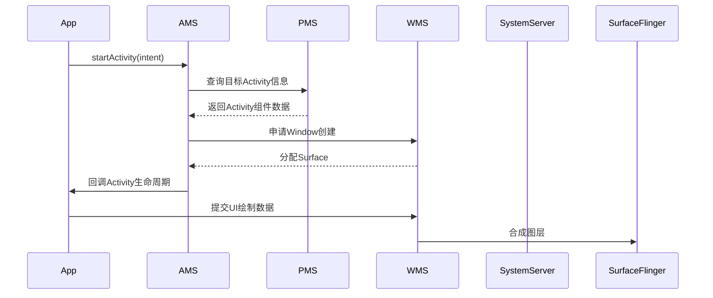
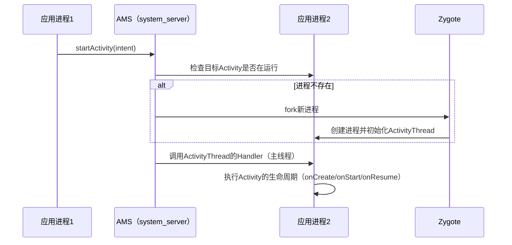

### **AMS、PMS、WMS 和 SystemServer 详解**

在 Android 系统中，**AMS（ActivityManagerService）、PMS（PackageManagerService）、WMS（WindowManagerService）** 是三个核心系统服务，它们都由 **SystemServer** 进程启动并管理，共同协作完成应用的生命周期管理、应用安装/权限控制、窗口管理等功能。

---

## **1. SystemServer（系统服务进程）**
### **作用**
- **Android 的核心进程**，由 `Zygote` 孵化，负责启动和管理所有系统服务（如 AMS、PMS、WMS）。
- **入口**：`SystemServer.main()` → `run()`。
- **运行在 `system_server` 进程**（非应用进程）。

### **启动流程**
1. **`Zygote` fork 出 `system_server` 进程**。
2. **初始化 `SystemServer`**：
   - 加载 `libandroid_servers.so`（Native 层系统服务）。
   - 启动 **Binder 线程池**（用于跨进程通信）。
3. **启动各类系统服务**：
   - **引导服务**（AMS、PMS、WMS 等）。
   - **核心服务**（如 `PowerManagerService`、`BatteryService`）。
   - **其他服务**（如 `InputManagerService`、`DisplayManagerService`）。

---

## **2. AMS（ActivityManagerService）**
### **作用**
- **管理 Activity 生命周期**（启动、销毁、切换）。
- **管理应用进程**（创建、回收、优先级调整）。
- **任务栈（Task）管理**（返回栈、多窗口模式）。

### **关键功能**
| **功能**               | **说明**                                                                 |
|------------------------|-------------------------------------------------------------------------|
| **启动 Activity**       | 解析 `Intent`，检查权限，创建进程（如果需要），调用 `ActivityThread` 相关方法。 |
| **进程管理**           | 通过 `ProcessList` 管理进程优先级（如 `foreground`、`visible`、`cached`）。   |
| **四大组件管理**       | 不仅管理 `Activity`，还涉及 `Service`、`BroadcastReceiver`、`ContentProvider`。 |
| **ANR 监控**           | 检测主线程卡顿（默认 5s 无响应触发 ANR）。                                 |

### **交互方式**
- 通过 `Binder` 与 `ActivityThread`（应用进程）通信。
- 使用 `Intent` 传递组件启动请求。

---

## **3. PMS（PackageManagerService）**
### **作用**
- **管理应用安装、卸载、更新**。
- **解析 `AndroidManifest.xml`**（权限、组件声明）。
- **权限控制**（检查应用是否声明了所需权限）。

### **关键功能**
| **功能**               | **说明**                                                                 |
|------------------------|-------------------------------------------------------------------------|
| **APK 安装**           | 解析 APK 文件，校验签名，将应用信息写入 `/data/system/packages.xml`。     |
| **权限管理**           | 检查 `<uses-permission>`，运行时权限（Android 6.0+）由 AMS 处理。          |
| **组件查询**           | 提供 `queryIntentActivities()` 等方法，用于隐式 `Intent` 解析。            |

### **交互方式**
- 通过 `Binder` 提供接口，如 `PackageManager` 的 API。
- 安装 APK 时，`adb` 或 `PackageInstaller` 会调用 PMS。

---

## **4. WMS（WindowManagerService）**
### **作用**
- **管理所有窗口（Window）的显示、层级、动画**。
- **输入事件分发**（触摸、按键事件路由）。
- **屏幕旋转、多窗口模式（分屏、画中画）**。

### **关键功能**
| **功能**               | **说明**                                                                 |
|------------------------|-------------------------------------------------------------------------|
| **窗口管理**           | 维护 `WindowList`，控制 `Z-order`（如 `Toast` 始终在最上层）。             |
| **布局与绘制**         | 与 `SurfaceFlinger` 协作，管理 `Surface` 的分配和合成。                   |
| **输入事件分发**       | 通过 `InputManagerService` 接收事件，决定哪个 `Window` 处理。              |

### **交互方式**
- 通过 `Binder` 与 `ViewRootImpl`（应用进程）通信。
- 控制 `Surface` 的创建和销毁（通过 `SurfaceFlinger`）。

---

## **5. 协作关系**

---

## **6. 常见问题**
### **Q1：AMS 和 PMS 的区别？**
- **AMS**：管理运行时的组件（如 Activity 栈、进程状态）。
- **PMS**：管理应用包信息（如安装、权限、`AndroidManifest.xml` 解析）。

### **Q2：WMS 如何管理窗口层级？**
- 每个 `Window` 对应一个 `WindowState`，WMS 根据 `Z-order` 排序（如 `TYPE_APPLICATION`、`TYPE_TOAST`）。

### **Q3：SystemServer 崩溃会怎样？**
- **系统重启**（进入 Recovery 或重启 `system_server`），用户会看到“系统 UI 无响应”。

### **Q4：这些服务运行在哪个线程？**
- **均在 `system_server` 的主线程**（但部分操作会异步处理，如 PMS 的 APK 扫描）。

---

## **7. 总结**
| **服务**      | **核心职责**                          | **交互对象**                     |
|--------------|-------------------------------------|--------------------------------|
| **AMS**      | 管理 Activity、进程、任务栈。           | `ActivityThread`、`ProcessList` |
| **PMS**      | 管理 APK 安装、权限、组件信息。          | `PackageInstaller`、`adb`       |
| **WMS**      | 管理窗口、输入事件、UI 合成。            | `ViewRootImpl`、`SurfaceFlinger`|
| **SystemServer** | 孵化并管理所有系统服务。               | `Zygote`、`Binder`             |

理解这些服务的工作机制，有助于优化 App 性能（如减少 AMS 的频繁调用）或解决复杂问题（如窗口层级冲突）。

在 Android 系统中，**AMS（ActivityManagerService）是全局唯一的**，而 **每个应用进程（App Process）有且仅有一个 `ActivityThread`**。它们的协作关系如下：

---

### **1. AMS（ActivityManagerService）**
- **全局唯一**：整个 Android 系统只有一个 AMS，运行在 `system_server` 进程（系统核心进程）中。
- **管理所有应用**：负责调度所有应用的 `Activity`、`Service`、`Broadcast` 等组件的生命周期。
- **跨进程通信**：通过 `Binder` 与各个应用的 `ActivityThread` 交互。

> **关键点**：无论系统中有多少个 App，AMS 只有一个，它是所有应用组件的“总指挥”。

---

### **2. ActivityThread**
- **每个应用进程一个**：每当一个应用启动时，系统会为其创建一个独立的进程，并在该进程中初始化一个 `ActivityThread`。
- **应用的“主线程”**：它是 App 进程的入口，负责管理应用的四大组件（`Activity`、`Service` 等）和主线程消息循环（`Looper`）。
- **与 AMS 通信**：通过 `Binder` 接收 AMS 的指令（如启动 `Activity`），并回调组件的生命周期方法。

> **关键点**：每个 App 进程有自己独立的 `ActivityThread`，但所有 `ActivityThread` 都受同一个 AMS 管理。

---

### **3. 协作流程示例（启动 Activity）**

---

### **4. 常见问题**
#### **Q1：为什么 AMS 是全局唯一的？**
- AMS 需要统一管理所有应用的组件（如避免多个 `Activity` 同时占据屏幕），如果每个 App 都有自己的 AMS，会导致冲突和资源竞争。

#### **Q2：`ActivityThread` 是线程吗？**
- 不是线程！虽然名字带 `Thread`，但它是一个 **Java 对象**，运行在应用的主线程（UI 线程）中，负责处理 AMS 的回调和主线程消息循环。

#### **Q3：多进程应用（如微信）会有多个 `ActivityThread` 吗？**
- 是的！每启动一个新进程（通过 `android:process` 声明），系统会为该进程创建一个独立的 `ActivityThread`，但 AMS 仍然是同一个。

---

### **5. 总结**
| **组件**          | **数量**               | **运行位置**          | **作用**                          |
|-------------------|-----------------------|----------------------|----------------------------------|
| **AMS**           | 全局唯一               | `system_server` 进程 | 管理所有应用的组件生命周期。       |
| **ActivityThread**| 每个应用进程一个        | 应用主线程           | 执行组件的生命周期和主线程消息处理。 |

**简单记忆**：  
- **AMS 是“大BOSS”**（一个系统一个）。  
- **`ActivityThread` 是“小弟”**（每个 App 进程一个，听 AMS 指挥）。