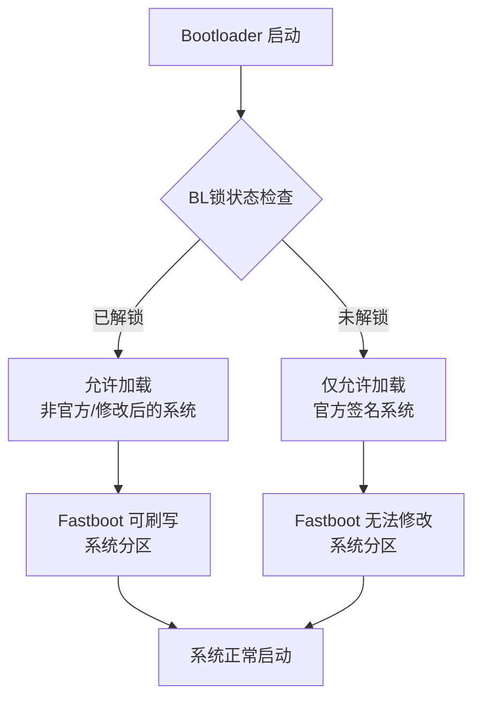

好的，这是一个非常核心的安卓系统底层概念。理解这三者的关系，对于玩转安卓刷机、救砖和系统修改至关重要。

简单来说：

*   **Fastboot** 是一个**工具和环境**，是操作的大门。
*   **BL锁** 是这道大门上的一把**锁**，决定了你能做什么操作。
*   **系统分区** 是门后面的一个**重要房间**，里面存放着操作系统的核心文件。

下面我们来详细解释它们各自的作用以及相互关系。

---

### 1. 三个核心概念的定义

#### **Fastboot**
*   **是什么**： 英文直译是“快速启动”，但它实际是一个**底层刷机协议**和与之配套的**命令行工具**。
*   **作用**： 当手机进入 **Fastboot 模式**（或称 Bootloader 模式）时，它就相当于电脑的 BIOS 或 UEFI 界面。在这个模式下，你可以通过电脑端的 `fastboot` 命令，直接与手机硬件进行通信，执行诸如刷写分区、解锁/上锁 Bootloader、获取设备信息等高级操作。
*   **类比**： 就像电脑的 **DOS 启动盘** 或 **PE 系统**，它是一个在主系统启动之前工作的、功能强大的“工程模式”。

#### **BL锁**
*   **是什么**： BL锁的全称是 **Bootloader Lock**，即**引导加载程序锁**。
*   **作用**： 这是手机厂商为了保护系统完整性和用户安全而设置的一道安全屏障。它的核心作用是**验证**。
    *   **锁定时**： 在手机启动时，Bootloader 会检查系统分区、内核等关键部件的数字签名，确保它们是由官方签发的、未被修改过的。如果验证失败，手机将拒绝启动，以防止恶意软件或损坏的系统被加载。
    *   **解锁后**： Bootloader 会跳过这个验证步骤，允许你刷入非官方的系统（如自定义 ROM）、修改系统分区等。
*   **类比**： 就像你家大门上的一把锁。锁着的时候，只有拥有正规钥匙（官方系统）的人才能进入。解锁后，谁都可以进出。

#### **系统分区**
*   **是什么**： 是手机存储芯片上一个**专用的、只读的**存储区域。
*   **作用**： 这个分区里存放着安卓操作系统的核心文件，包括系统框架、预装应用、系统UI等。当你开机后，手机就是从这里面加载操作系统。
*   **类比**： 就像你电脑的 **C盘系统盘**，里面装着 Windows 系统文件。

---

### 2. 三者之间的相互作用关系

这三者构成了一个紧密的链条，下图清晰地展示了它们的核心关系：

具体来说，它们的互动体现在以下几个关键场景中：

**场景一：正常启动一台新手机**
1.  开机 → Bootloader 启动（BL锁**未解锁**） → 检查`系统分区`的签名 → 签名正确（是官方系统） → 加载`系统分区` → 进入安卓系统。

**场景二：想要刷入第三方ROM（如LineageOS）**
1.  你必须先进入 `Fastboot` 模式。
2.  在 `Fastboot` 模式下，执行 `fastboot flashing unlock` 等命令来**解锁BL锁**。（这会清除手机数据，俗称“清数据”）。
3.  BL锁解锁后，你才能使用 `Fastboot` 命令，例如 `fastboot flash system lineageos.img`，将新的系统镜像刷入**系统分区**。
4.  重启后：开机 → Bootloader 启动（BL锁**已解锁**） → 跳过签名验证或验证宽松 → 加载你刚刷入的第三方`系统分区` → 进入新系统。

**场景三：系统分区损坏，无法开机（“变砖”）**
*   **如果BL锁已解锁**：你可以轻松进入 `Fastboot` 模式，然后使用 `fastboot flash system ...` 命令重新刷入一个完好的系统镜像到**系统分区**，从而救活手机。
*   **如果BL锁未解锁**：情况会复杂很多。因为 Bootloader 只允许加载官方的、签名正确的系统，而你无法通过 `Fastboot` 随意刷写。这时通常只能依赖厂商提供的**官方救砖工具**，它会利用特定的签名漏洞或授权来恢复设备。

---

### 总结对比表

| 项目 | Fastboot | BL锁 | 系统分区 |
| :--- | :--- | :--- | :--- |
| **角色** | **操作平台/工具** | **安全守卫/权限开关** | **被保护的对象/核心资产** |
| **主要功能** | 执行底层刷机命令 | 验证系统完整性 | 存储操作系统文件 |
| **关系比喻** | **工程维修间** | **维修间的门锁** | **存放核心部件的仓库** |
| **对用户的意义** | 刷机、救砖的入口 | 决定你是否有权限修改系统 | 决定了你最终运行的是什么系统 |

**一句话总结：** 你需要在 **Fastboot** 模式下，解除 **BL锁** 的限制，才能自由地刷写 **系统分区** 的内容。这三者共同构成了安卓系统自由度和安全性的基础。