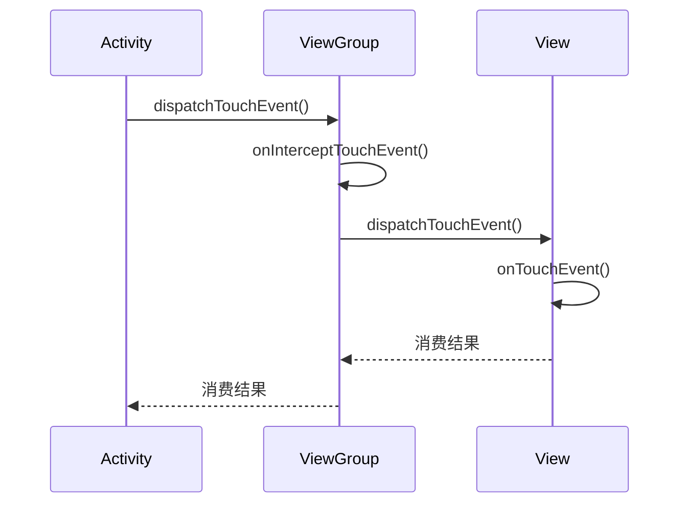

# Android 事件分发机制详解

Android 的事件分发机制是一个从底层驱动到应用层的完整处理流程，主要处理触摸事件（MotionEvent）的分发与消费。理解这一机制对于处理复杂的手势冲突和自定义触摸行为至关重要。

## 一、事件分发核心流程



## 二、核心参与者的职责

### 1. Activity
- **入口点**：最先接收事件
- **兜底处理**：所有View未处理时调用`onTouchEvent()`
```java
public boolean dispatchTouchEvent(MotionEvent ev) {
    if (getWindow().superDispatchTouchEvent(ev)) {
        return true; // View层次结构已消费
    }
    return onTouchEvent(ev); // 活动自己处理
}
```

### 2. ViewGroup（核心调度者）
- **拦截决策**：通过`onInterceptTouchEvent()`决定是否拦截
- **子View分发**：遍历子View调用`dispatchTouchEvent()`
- **默认行为**：不拦截（返回false）

### 3. View（最终处理者）
- **消费判断**：通过`onTouchEvent()`决定是否消费
- **处理优先级**：
  1. `OnTouchListener`（若设置）
  2. `onTouchEvent()`方法
  3. `OnClickListener`等（在`onTouchEvent()`内部处理）

## 三、事件类型与序列

| 事件类型                | 触发时机                     | 典型处理场景               |
|-------------------------|------------------------------|---------------------------|
| `ACTION_DOWN`           | 手指初次触摸屏幕             | 决定是否接受事件序列       |
| `ACTION_MOVE`           | 手指在屏幕上移动             | 处理滑动操作               |
| `ACTION_UP`             | 手指离开屏幕                 | 确认点击或结束手势         |
| `ACTION_CANCEL`         | 事件被父View拦截             | 清理临时状态               |

**重要规则**：
- 一个事件序列必须被同一个View消费
- `ACTION_DOWN`未被消费则后续事件不会传递到该View

## 四、分发流程源码解析

### 1. ViewGroup.dispatchTouchEvent() 关键逻辑
```java
public boolean dispatchTouchEvent(MotionEvent ev) {
    // 1. 检查拦截
    final boolean intercepted;
    if (actionMasked == ACTION_DOWN || mFirstTouchTarget != null) {
        intercepted = onInterceptTouchEvent(ev);
    } else {
        intercepted = true; // 没有目标且非DOWN事件则拦截
    }
    
    // 2. 遍历子View
    if (!canceled && !intercepted) {
        for (int i = childrenCount - 1; i >= 0; i--) {
            if (child.dispatchTouchEvent(ev)) {
                mFirstTouchTarget = child; // 记录消费事件的子View
                return true;
            }
        }
    }
    
    // 3. 自身处理
    return super.dispatchTouchEvent(ev);
}
```

### 2. View.onTouchEvent() 核心逻辑
```java
public boolean onTouchEvent(MotionEvent event) {
    // 1. 检查可点击性
    if ((viewFlags & CLICKABLE) == CLICKABLE || ...) {
        switch (action) {
            case ACTION_UP:
                performClick(); // 触发点击事件
                break;
            case ACTION_DOWN:
                setPressed(true); // 显示按压状态
                break;
        }
        return true; // 消费事件
    }
    return false;
}
```

## 五、常见冲突解决方案

### 1. 滑动冲突类型
- **同方向冲突**：如ViewPager内嵌RecyclerView
- **不同方向冲突**：如ScrollView内嵌水平ListView

### 2. 解决策略
#### 外部拦截法（推荐）
```java
// 父容器重写onInterceptTouchEvent()
@Override
public boolean onInterceptTouchEvent(MotionEvent ev) {
    if (ev.getAction() == ACTION_DOWN) {
        return false; // DOWN事件必须不拦截
    }
    return 判断滑动条件; // 根据业务逻辑决定是否拦截
}
```

#### 内部拦截法
```java
// 子View重写dispatchTouchEvent()
@Override
public boolean dispatchTouchEvent(MotionEvent ev) {
    getParent().requestDisallowInterceptTouchEvent(true); // 请求父容器不拦截
    if (需要父容器处理) {
        getParent().requestDisallowInterceptTouchEvent(false);
    }
    return super.dispatchTouchEvent(ev);
}
```

## 六、高级应用技巧

### 1. 手势检测（GestureDetector）
```java
GestureDetector detector = new GestureDetector(context, 
    new GestureDetector.SimpleOnGestureListener() {
        @Override
        public boolean onScroll(MotionEvent e1, MotionEvent e2, 
                float distanceX, float distanceY) {
            // 处理滚动
            return true;
        }
    });

@Override
public boolean onTouchEvent(MotionEvent event) {
    return detector.onTouchEvent(event);
}
```

### 2. 嵌套滚动（NestedScrolling）
```java
// 实现NestedScrollingChild接口
@Override
public boolean dispatchTouchEvent(MotionEvent ev) {
    startNestedScroll(SCROLL_AXIS_HORIZONTAL);
    // ...处理事件
    dispatchNestedPreScroll(dx, dy, consumed, offsetInWindow);
    dispatchNestedScroll(consumedX, consumedY, ...);
    stopNestedScroll();
}
```

### 3. 触摸事件重定向
```java
// 将触摸事件传递给特定View
public boolean dispatchTouchEvent(MotionEvent ev) {
    if (shouldRedirect) {
        return targetView.dispatchTouchEvent(ev);
    }
    return super.dispatchTouchEvent(ev);
}
```

理解事件分发机制需要重点掌握：
1. **责任链模式**的传递流程
2. `ACTION_DOWN`的特殊性
3. 拦截时机的选择（DOWN事件必须放行）
4. 冲突解决的实际场景应用

通过合理利用这些机制，可以构建出既灵活又高效的触摸交互体验。


# Android滑动冲突解决方案详解

针对同方向和不同方向的滑动冲突，我将分别提供具体的解决方案和实现代码。

## 一、同方向冲突：ViewPager内嵌RecyclerView

### 解决方案：外部拦截法（父容器控制）

```java
public class CustomViewPager extends ViewPager {
    private float initialXValue;
    private int touchSlop;
    private float lastX;

    public CustomViewPager(Context context, AttributeSet attrs) {
        super(context, attrs);
        touchSlop = ViewConfiguration.get(context).getScaledTouchSlop();
    }

    @Override
    public boolean onInterceptTouchEvent(MotionEvent event) {
        switch (event.getAction()) {
            case MotionEvent.ACTION_DOWN:
                initialXValue = event.getX();
                lastX = event.getX();
                super.onInterceptTouchEvent(event);
                return false; // 必须返回false，确保子View能接收到事件

            case MotionEvent.ACTION_MOVE:
                float currentX = event.getX();
                float deltaX = Math.abs(currentX - lastX);
                lastX = currentX;
                
                // 判断是否是横向滑动
                if (deltaX > touchSlop) {
                    return true; // 拦截事件，由ViewPager处理
                }
                break;
        }
        return super.onInterceptTouchEvent(event);
    }
}
```

### 优化版：考虑子RecyclerView的滚动状态

```java
@Override
public boolean onInterceptTouchEvent(MotionEvent event) {
    switch (event.getAction()) {
        case MotionEvent.ACTION_DOWN:
            initialXValue = event.getX();
            lastX = event.getX();
            getParent().requestDisallowInterceptTouchEvent(true);
            return false;

        case MotionEvent.ACTION_MOVE:
            float currentX = event.getX();
            float deltaX = Math.abs(currentX - lastX);
            float deltaY = Math.abs(event.getY() - initialYValue);
            lastX = currentX;
            
            // 判断滑动方向
            if (deltaX > touchSlop && deltaX > deltaY * 2) {
                // 横向滑动占优
                View child = findCurrentFocusedChild();
                if (child instanceof RecyclerView) {
                    RecyclerView rv = (RecyclerView) child;
                    // 如果RecyclerView可以水平滑动，则不拦截
                    if (canScrollHorizontally(rv)) {
                        return false;
                    }
                }
                return true;
            }
            break;
    }
    return super.onInterceptTouchEvent(event);
}

private boolean canScrollHorizontally(RecyclerView rv) {
    LinearLayoutManager lm = (LinearLayoutManager) rv.getLayoutManager();
    int firstVisible = lm.findFirstVisibleItemPosition();
    int lastVisible = lm.findLastVisibleItemPosition();
    
    // 判断是否已经滚动到边界
    if (firstVisible == 0 && lastVisible == lm.getItemCount() - 1) {
        View first = lm.findViewByPosition(firstVisible);
        View last = lm.findViewByPosition(lastVisible);
        return first.getLeft() < 0 || last.getRight() > rv.getWidth();
    }
    return true;
}
```

## 二、不同方向冲突：ScrollView内嵌水平ListView

### 解决方案1：内部拦截法（子View控制）

```java
public class HorizontalListView extends RecyclerView {
    private float lastX, lastY;

    public HorizontalListView(Context context) {
        super(context);
        setLayoutManager(new LinearLayoutManager(context, LinearLayoutManager.HORIZONTAL, false));
    }

    @Override
    public boolean dispatchTouchEvent(MotionEvent ev) {
        float x = ev.getX();
        float y = ev.getY();
        
        switch (ev.getAction()) {
            case MotionEvent.ACTION_DOWN:
                lastX = x;
                lastY = y;
                // 禁止父ScrollView拦截
                getParent().requestDisallowInterceptTouchEvent(true);
                break;

            case MotionEvent.ACTION_MOVE:
                float deltaX = Math.abs(x - lastX);
                float deltaY = Math.abs(y - lastY);
                lastX = x;
                lastY = y;
                
                // 如果是横向滑动且可以水平滑动，继续禁止父View拦截
                if (deltaX > deltaY && canScrollHorizontally((int)(x - lastX))) {
                    getParent().requestDisallowInterceptTouchEvent(true);
                } else {
                    // 允许父View拦截
                    getParent().requestDisallowInterceptTouchEvent(false);
                }
                break;
        }
        return super.dispatchTouchEvent(ev);
    }
}
```

### 解决方案2：自定义ScrollView

```java
public class CustomScrollView extends ScrollView {
    private float xDistance, yDistance, lastX, lastY;

    @Override
    public boolean onInterceptTouchEvent(MotionEvent ev) {
        switch (ev.getAction()) {
            case MotionEvent.ACTION_DOWN:
                xDistance = yDistance = 0f;
                lastX = ev.getX();
                lastY = ev.getY();
                break;

            case MotionEvent.ACTION_MOVE:
                final float curX = ev.getX();
                final float curY = ev.getY();
                xDistance += Math.abs(curX - lastX);
                yDistance += Math.abs(curY - lastY);
                lastX = curX;
                lastY = curY;
                
                // 判断滑动方向
                if (xDistance > yDistance) {
                    return false; // 横向滑动不拦截
                }
        }
        return super.onInterceptTouchEvent(ev);
    }
}
```

## 三、通用优化技巧

### 1. 滑动阈值优化

```java
// 在ViewConfiguration中获取系统定义的阈值
int touchSlop = ViewConfiguration.get(context).getScaledTouchSlop();
int minimumFlingVelocity = ViewConfiguration.get(context).getScaledMinimumFlingVelocity();
int maximumFlingVelocity = ViewConfiguration.get(context).getScaledMaximumFlingVelocity();
```

### 2. 嵌套滚动机制（API 21+）

```java
// 父容器实现NestedScrollingParent3
public class NestedScrollViewV2 extends ScrollView implements NestedScrollingParent3 {
    private NestedScrollingParentHelper parentHelper;
    
    @Override
    public boolean onStartNestedScroll(View child, View target, int axes, int type) {
        return (axes & ViewCompat.SCROLL_AXIS_VERTICAL) != 0;
    }
    
    @Override
    public void onNestedPreScroll(View target, int dx, int dy, int[] consumed, int type) {
        if (Math.abs(dy) > Math.abs(dx)) {
            // 垂直滑动优先
            scrollBy(0, dy);
            consumed[1] = dy;
        }
    }
}

// 子View实现NestedScrollingChild3
public class NestedRecyclerView extends RecyclerView implements NestedScrollingChild3 {
    private NestedScrollingChildHelper childHelper;
    
    @Override
    public boolean startNestedScroll(int axes, int type) {
        return childHelper.startNestedScroll(axes, type);
    }
    
    @Override
    public void dispatchNestedPreScroll(int dx, int dy, int[] consumed, int[] offsetInWindow, int type) {
        childHelper.dispatchNestedPreScroll(dx, dy, consumed, offsetInWindow, type);
    }
}
```

### 3. 使用更现代的布局组件

```xml
<!-- 使用ConstraintLayout替代ScrollView+ListView的组合 -->
<androidx.constraintlayout.widget.ConstraintLayout
    android:layout_width="match_parent"
    android:layout_height="match_parent">
    
    <androidx.recyclerview.widget.RecyclerView
        android:id="@+id/horizontal_list"
        android:layout_width="0dp"
        android:layout_height="wrap_content"
        android:orientation="horizontal"
        app:layoutManager="androidx.recyclerview.widget.LinearLayoutManager"
        app:layout_constraintLeft_toLeftOf="parent"
        app:layout_constraintRight_toRightOf="parent"
        app:layout_constraintTop_toTopOf="parent"/>
    
    <androidx.recyclerview.widget.RecyclerView
        android:id="@+id/vertical_list"
        android:layout_width="0dp"
        android:layout_height="0dp"
        android:orientation="vertical"
        app:layoutManager="androidx.recyclerview.widget.LinearLayoutManager"
        app:layout_constraintBottom_toBottomOf="parent"
        app:layout_constraintLeft_toLeftOf="parent"
        app:layout_constraintRight_toRightOf="parent"
        app:layout_constraintTop_toBottomOf="@id/horizontal_list"/>
</androidx.constraintlayout.widget.ConstraintLayout>
```

## 四、选择方案的建议

1. **同方向冲突**：
   - 优先使用外部拦截法
   - 考虑使用NestedScroll机制（API 21+）
   - 对于ViewPager+RecyclerView，可以自定义ViewPager的`onInterceptTouchEvent`

2. **不同方向冲突**：
   - 优先使用内部拦截法（子View控制）
   - 或者自定义父容器的`onInterceptTouchEvent`
   - 考虑使用ConstraintLayout等现代布局替代嵌套滚动视图

3. **通用建议**：
   - 避免深层嵌套滚动视图
   - 对于复杂界面，考虑使用单一RecyclerView+多类型Item
   - 合理使用`requestDisallowInterceptTouchEvent`控制事件流

以上方案可以根据实际业务需求进行组合和调整，建议在实现后进行全面的手势测试，确保各种滑动场景都能正确处理。