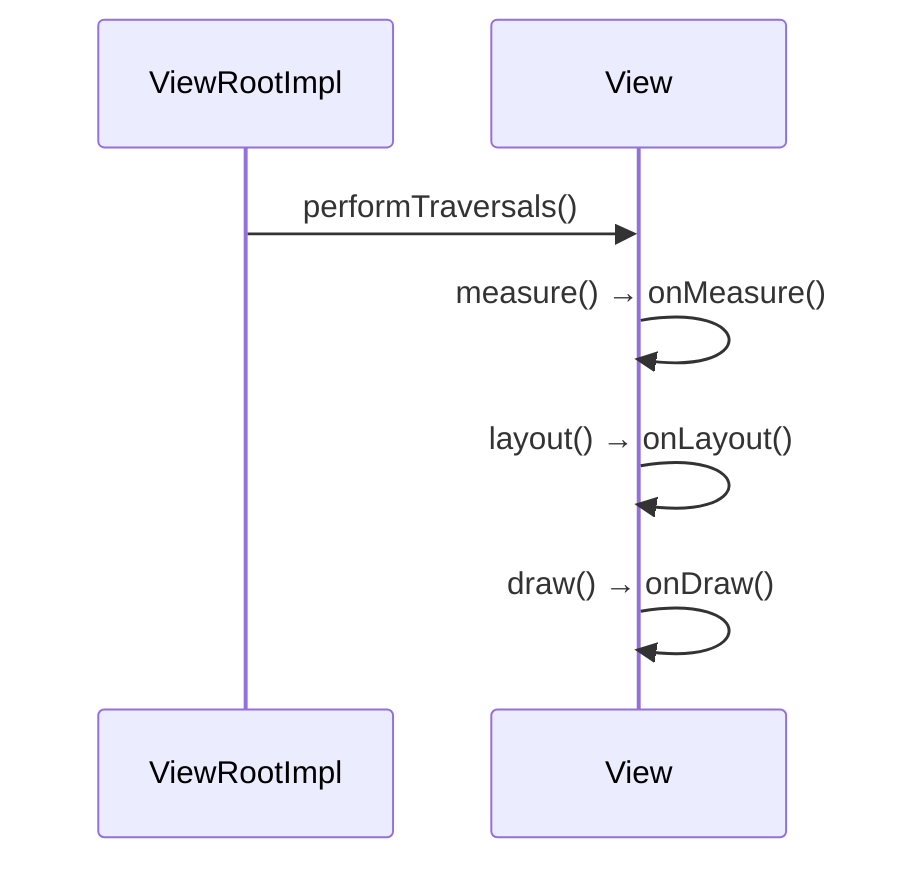

# View 的测量、布局、绘制流程详解

Android 中 View 的显示过程包含三个核心阶段：测量(Measure)、布局(Layout)和绘制(Draw)。这是 View 系统工作的基础流程，理解这一机制对自定义 View 和性能优化至关重要。

## 一、整体流程概览



## 二、测量阶段 (Measure)

### 1. 核心方法
- `measure(int widthMeasureSpec, int heightMeasureSpec)`
- `onMeasure(int widthMeasureSpec, int heightMeasureSpec)`

### 2. MeasureSpec 组成
```java
int specMode = MeasureSpec.getMode(measureSpec); // 测量模式
int specSize = MeasureSpec.getSize(measureSpec); // 测量尺寸
```

| 模式                  | 说明                                                                 |
|-----------------------|----------------------------------------------------------------------|
| `EXACTLY` (精确模式)  | 父View已确定子View的精确尺寸 (对应match_parent或具体数值)            |
| `AT_MOST` (最大模式)  | 子View不能超过指定大小 (对应wrap_content)                           |
| `UNSPECIFIED` (未指定)| 父View未施加任何限制 (少见，如ScrollView测量子View时)                |

### 3. 测量流程
```java
protected void onMeasure(int widthMeasureSpec, int heightMeasureSpec) {
    // 1. 计算自身内容尺寸
    int contentWidth = calculateContentWidth();
    int contentHeight = calculateContentHeight();
    
    // 2. 考虑父View的限制条件
    int width = resolveSize(contentWidth, widthMeasureSpec);
    int height = resolveSize(contentHeight, heightMeasureSpec);
    
    // 3. 必须调用setMeasuredDimension()保存结果
    setMeasuredDimension(width, height);
}
```

### 4. 自定义View测量要点
- 必须处理 `wrap_content` 情况（否则表现会与 `match_parent` 相同）
- 必须调用 `setMeasuredDimension()` 
- 考虑 `padding` 的影响：
  ```java
  final int width = getPaddingLeft() + contentWidth + getPaddingRight();
  ```

## 三、布局阶段 (Layout)

### 1. 核心方法
- `layout(int l, int t, int r, int b)`
- `onLayout(boolean changed, int l, int t, int r, int b)`

### 2. 布局流程
```java
public void layout(int l, int t, int r, int b) {
    // 1. 比较新旧位置是否变化
    boolean changed = setFrame(l, t, r, b);
    
    // 2. 如果需要重新布局
    if (changed || mPrivateFlags...) {
        onLayout(changed, l, t, r, b); // ViewGroup需要重写此方法布局子View
    }
}
```

### 3. ViewGroup 的布局实现
```java
protected void onLayout(boolean changed, int l, int t, int r, int b) {
    for (int i = 0; i < getChildCount(); i++) {
        View child = getChildAt(i);
        // 计算每个子View的位置
        child.layout(childLeft, childTop, 
                   childLeft + childWidth, 
                   childTop + childHeight);
    }
}
```

### 4. 布局要点
- `layout()` 参数是相对于父View的坐标
- 需要考虑 `margin` 和 `gravity` 等属性
- 在自定义ViewGroup时必须重写 `onLayout()`

## 四、绘制阶段 (Draw)

### 1. 绘制流程
```java
public void draw(Canvas canvas) {
    // 1. 绘制背景
    drawBackground(canvas);
    
    // 2. 如果需要，保存canvas层（透明/渐变等效果）
    saveCount = canvas.getSaveCount();
    canvas.saveLayer(...);
    
    // 3. 绘制内容（onDraw方法）
    onDraw(canvas);
    
    // 4. 绘制子View（dispatchDraw）
    dispatchDraw(canvas);
    
    // 5. 绘制装饰（如滚动条）
    onDrawForeground(canvas);
    
    // 6. 恢复canvas层
    canvas.restoreToCount(saveCount);
}
```

### 2. 核心绘制方法
| 方法                  | 说明                                                                 |
|-----------------------|----------------------------------------------------------------------|
| `onDraw(Canvas)`      | 绘制View自身内容（自定义View必须重写）                              |
| `dispatchDraw(Canvas)`| ViewGroup用此方法绘制子View（非ViewGroup默认空实现）                |
| `draw(Canvas)`        | 整个绘制过程的调度方法（通常不需要重写）                            |

### 3. 绘制优化技巧
- 减少过度绘制：使用 `canvas.clipRect()`
- 避免在 `onDraw()` 中创建对象（如 `Paint`）
- 使用 `View.setWillNotDraw(true)` 跳过不需要绘制的View
- 考虑使用硬件加速（`LAYER_TYPE_HARDWARE`）

## 五、完整流程示例（自定义View）

```java
public class CircleView extends View {
    private Paint mPaint;
    
    public CircleView(Context context) {
        super(context);
        init();
    }
    
    private void init() {
        mPaint = new Paint(Paint.ANTI_ALIAS_FLAG);
        mPaint.setColor(Color.RED);
    }
    
    @Override
    protected void onMeasure(int widthSpec, int heightSpec) {
        int size = resolveSize(100, widthSpec); // 默认100px
        setMeasuredDimension(size, size); // 保持宽高相同
    }
    
    @Override
    protected void onDraw(Canvas canvas) {
        super.onDraw(canvas);
        int radius = Math.min(getWidth(), getHeight()) / 2;
        canvas.drawCircle(getWidth()/2, getHeight()/2, radius, mPaint);
    }
}
```

## 六、性能优化关键点

1. **减少测量/布局次数**
   - 避免在 `onMeasure()`/`onLayout()` 中请求重新布局
   - 使用 `View.measure()` 提前测量

2. **层级优化**
   - 使用 `merge` 标签减少布局层级
   - 考虑使用 `ConstraintLayout`

3. **绘制优化**
   - 使用 `ViewStub` 延迟加载
   - 对复杂View考虑使用 `TextureView` 或 `SurfaceView`

4. **调试工具**
   - **Layout Inspector**：查看视图层级
   - **GPU过度绘制调试**：设置→开发者选项→显示过度绘制
   - **Profile GPU Rendering**：分析渲染性能

理解View的工作流程可以帮助开发者创建高效的自定义组件，并有效解决UI性能问题。在实际开发中，应特别注意避免在测量和绘制阶段进行耗时操作。