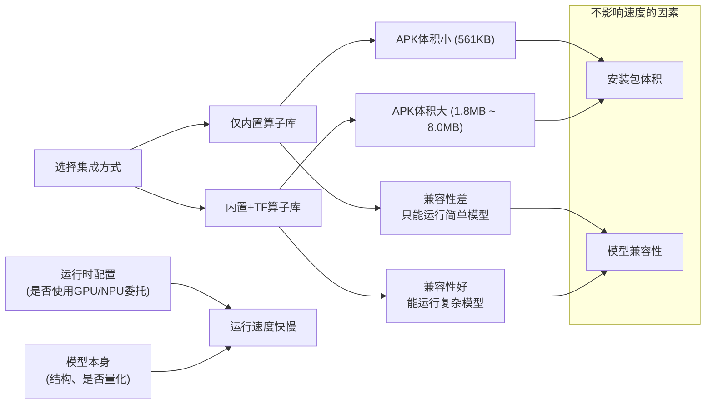

# 迁移学习与TensorFlow Lite模型转换

## 迁移学习 (Transfer Learning)

迁移学习允许您采用已经训练好的模型并重新训练，以执行新的相关任务。

### 优势
- **节省时间**：与从头开始训练相比，重新训练花费的时间更少
- **减少数据需求**：所需训练数据量大幅减少
- **提高性能**：基于预训练模型的良好特征提取能力

### 应用示例
图像分类模型可以重新训练以识别新的图像类别。例如，在用TensorFlow识别花朵的codelab中，您可以学习如何进行迁移学习实践。

## TensorFlow Lite模型转换

### 自定义模型训练
如果您设计并训练了自己的TensorFlow模型，或从其他来源获得训练好的模型，在使用前需要将模型转换为TensorFlow Lite格式。

### TensorFlow Lite解释器 (Interpreter)
TensorFlow Lite解释器是一个库，其主要功能包括：

- **接收模型文件**：加载转换后的.tflite模型文件
- **执行运算**：在输入数据上执行模型文件中定义的运算符
- **提供输出访问**：使应用程序能够获取模型的推理结果

### 转换流程
```
训练好的TensorFlow模型 → 转换为TensorFlow Lite格式 → 在移动/嵌入式设备上部署
```

这种工作流程让开发者能够充分利用预训练模型的能力，同时适应特定的应用需求，并在资源受限的设备上高效运行模型。

# GPU 加速与 TensorFlow Lite 委托

## 硬件加速的优势

移动设备通常配备 GPU（图形处理器），能够比 CPU 更高效地执行机器学习运算，特别是浮点矩阵运算。

### 性能提升示例
- **显著加速**：使用 GPU 加速可获得可观的性能提升
- **具体案例**：MobileNet v1 图像分类模型在 Pixel 3 手机上使用 GPU 加速后，运行速度提升 **5.5 倍**

## TensorFlow Lite 委托机制

TensorFlow Lite 解释器支持通过委托机制利用设备上的硬件加速功能。

### GPU 委托
GPU 委托允许解释器在设备的 GPU 上运行适合的运算，从而提升模型执行效率。

## 代码实现示例

### Java 中的 GPU 委托使用

```java
// 创建 GPU 委托实例
GpuDelegate delegate = new GpuDelegate();

// 配置解释器选项并添加委托
Interpreter.Options options = (new Interpreter.Options()).addDelegate(delegate);

// 创建带有 GPU 委托的解释器
Interpreter interpreter = new Interpreter(tensorflow_lite_model_file, options);

try {
  // 使用 GPU 加速运行模型
  interpreter.run(input, output);
} finally {
  // 清理资源
  delegate.close();
}
```

### 使用流程
1. 创建 `GpuDelegate` 实例
2. 配置 `Interpreter.Options` 并添加委托
3. 使用配置好的选项初始化解释器
4. 正常运行模型，运算将在 GPU 上执行

## 优势总结
- **性能提升**：利用 GPU 并行计算能力加速模型推理
- **能效优化**：相比 CPU，GPU 在执行矩阵运算时能效更高
- **无缝集成**：通过简单的委托机制实现硬件加速，无需修改模型结构

## 案例

- **TensorFlow Lite Android 图像分类.**
https://github.com/tensorflow/examples/tree/master/lite/examples/image_classification/android

## 案例
- **由于 TensorFlow Lite 内置算子库仅支持有限数量的 TensorFlow 算子，所以并非所有模型都可以转换。有关详细信息，请参阅算子兼容性。**

- **为了允许进行转换，用户可以在 TensorFlow Lite 模型中启用特定 TensorFlow 算子的使用。但是，运行带 TensorFlow 算子的 TensorFlow Lite 模型需要引入核心 TensorFlow 运行时，这会增加 TensorFlow Lite 解释器的二进制文件大小。对于 Android，您可以通过有选择地仅构建所需 Tensorflow 算子来避免这种情况。有关详情，请参阅缩减二进制文件大小。**


# TensorFlow Lite 二进制文件大小分析

## 构建配置与文件大小对比表

| 构建类型 | C++ 二进制文件大小 | Android APK 大小 |
|---------|-------------------|-----------------|
| 仅内置算子 | 796 KB | 561 KB |
| 内置算子 + TF 算子 | 23.0 MB | 8.0 MB |
| 内置算子 + TF 算子 (1) | 4.1 MB | 1.8 MB |

## 表格分析说明

### 1. 核心结论
此表格清晰地展示了**算子选择对TensorFlow Lite模型部署大小的显著影响**，文件大小差异可达数十倍。

### 2. 具体分析

#### (1) 仅内置算子
- **最小体积**：C++二进制仅796KB，APK仅561KB
- **适用场景**：只使用TFLite原生支持的算子
- **优势**：极小的资源占用，适合移动端和嵌入式设备
- **限制**：功能受限，无法运行复杂模型

#### (2) 内置算子 + TF算子（完整）
- **最大体积**：C++二进制达23.0MB，APK为8.0MB
- **原因**：包含了完整的TensorFlow算子支持
- **适用场景**：需要运行复杂模型且对体积不敏感的应用
- **劣势**：显著增加应用大小，可能影响用户下载意愿

#### (3) 内置算子 + TF算子（优化版）
- **平衡方案**：C++二进制4.1MB，APK为1.8MB
- **可能优化**：选择性包含常用TF算子或使用更高效的编译选项
- **适用场景**：需要在功能和体积间取得平衡的应用

### 3. 实际应用启示

1. **按需选择**：根据模型复杂度选择合适的构建方式
2. **权衡考量**：功能完整性 vs 应用体积 vs 性能需求
3. **优化策略**：
   - 优先使用TFLite原生算子
   - 仅添加必要的自定义算子
   - 考虑模型量化进一步减小体积

### 4. 开发建议

- 对于简单模型：选择**仅内置算子**以最小化应用体积
- 对于复杂模型：评估使用**优化版TF算子**构建
- 对于研究或原型开发：可使用**完整TF算子**构建以获得最大灵活性

此表格帮助开发者理解TensorFlow Lite在不同配置下的资源需求，为移动端AI应用开发提供重要参考。


非常好的问题！您的理解**基本正确，但需要做一些关键的澄清和补充**。您抓住了核心的权衡关系，但细节上略有偏差。

让我们来详细分解一下。

### 核心结论

您的理解可以更精确地表述为：

**选择更完整、更大的算子库（如包含TF算子），通常意味着APK体积更大，但能获得更强的模型兼容性（能运行更复杂的模型），而性能（速度）则取决于是否使用了硬件加速（如GPUDelegate），与库的大小没有直接的正比关系。**

---

### 详细解释

#### 1. 关于“NDK集成C++比较大但是比较快”

- **“比较大”**：正确。从表格可以看出，集成了TF算子的C++二进制库本身（`.so`文件）确实非常大（23MB或4.1MB）。
- **“比较快”**：**不完全准确。库的大小不直接决定速度快慢。**
    - **速度的决定因素**主要是：
        1.  **硬件加速**：是否使用了GPU、DSP、NPU等委托（Delegate）。这是最大的性能提升点。
        2.  **算子优化**：无论是内置算子还是TF算子，TensorFlow团队都会对它们进行高度优化。大的库包含了更多算子，但不代表每个算子都更快。
        3.  **模型本身**：模型的结构、参数量、是否量化（int8 vs float32）才是运行速度的根本。
    - **大库的优势在于兼容性**：它能让更多复杂的、使用非常见算子的模型**跑起来**。没有这个大库，模型根本无法运行，就谈不上速度了。它提供了“可能性”而非绝对的“高性能”。

#### 2. 关于“APK集成比较大但是比较慢”

- **“比较大”**：正确。APK体积变大的主要原因就是集成了更大的C++库（`.so`文件）和可能的Java封装代码。
- **“比较慢”**：**不正确。APK的体积和运行速度没有直接的因果关系。**
    - 一个集成了完整TF算子的大APK，**同样可以使用GPUDelegate**，从而获得极快的推理速度。
    - 一个仅包含内置算子的小APK，如果只使用CPU运行一个复杂模型，也可能会很慢。
    - **速度取决于运行时（Runtime）的配置**，而不是安装包（APK）的大小。

---

### 正确的权衡关系图

我们应该从两个维度来理解表格带来的权衡：



### 给开发者的建议

1.  **首选“仅内置算子”**：
    - 如果你的模型使用的都是TFLite原生支持的算子，这是最优解。APK体积最小，用户下载体验最好。

2.  **不得已而选择“内置+TF算子”**：
    - 只有当你的模型包含TFLite原生不支持的算子时，才需要选择这个方案。你用更大的APK体积，换来了**模型的兼容性和可运行性**。

3.  **性能优化是另一个维度的事**：
    - 无论选择哪个库，之后都要通过**添加Delegate（GPU、NNAPI等）** 和**模型量化**来优化速度与功耗。这与库的大小选择是正交的、可同时进行的步骤。

**总结一下：**

您的理解应修正为：**更大的库（NDK的.so或APK）牺牲了体积，换来了更好的模型兼容性，而不是直接换来了速度。速度的快慢需要通过硬件加速等其它手段来优化。**


# TensorFlow Lite 模型优化与更换

## 训练后量化

训练后量化是一种转换技术，可以缩减模型大小并缩短推断延迟，同时改善 CPU 和硬件加速器推断速度，且几乎不会降低模型准确率。因此，它被广泛用于优化模型。

Model Maker 库在导出模型时会应用默认的训练后量化技术。如果您想自定义训练后量化，Model Maker 也支持使用 `QuantizationConfig` 的多个训练后量化选项。

以 float16 量化为例，首先定义量化配置：

```python
# 定义量化配置示例
quantization_config = QuantizationConfig.for_float16()
```


为
## 模型更换

### 更改为此库支持的模型

此库目前支持 EfficientNet-Lite、MobileNetV2 和 ResNet50 模型。EfficientNet-Lite 是一系列图像分类模型，可以实现最先进的准确率，并适用于 Edge 设备。默认模型为 EfficientNet-Lite0。

将模型切换为 MobileNetV2：

```python
model = image_classifier.create(
    train_data, 
    model_spec=model_spec.get('mobilenet_v2'), 
    validation_data=validation_data
)
```

评估新近重新训练的 MobileNetV2 模型，查看测试数据中的准确率和损失：

```python
loss, accuracy = model.evaluate(test_data)
```

### 更改为 TensorFlow Hub 中的模型

此外，我们还可以切换为其他新模型，这些模型输入图像并输出具有 TensorFlow Hub 格式的特征向量。

以 Inception V3 模型为例：

```python
# 定义 Inception V3 模型规范
inception_v3_spec = image_classifier.ModelSpec(
    uri='https://tfhub.dev/google/imagenet/inception_v3/feature_vector/1'
)
inception_v3_spec.input_image_shape = [299, 299]  # 修改输入图像尺寸
```

将 `create` 方法中的参数 `model_spec` 设置为 `inception_v3_spec`，便可重新训练 Inception V3 模型：

```python
model = image_classifier.create(
    train_data,
    model_spec=inception_v3_spec,
    validation_data=validation_data
)
```

其余步骤完全相同，最后我们可以获得自定义的 InceptionV3 TensorFlow Lite 模型。

### 更改您的自定义模型

如果我们想使用 TensorFlow Hub 中没有的自定义模型，应在 TensorFlow Hub 中创建并导出 ModelSpec。

然后像上面的过程一样开始定义 ModelSpec 对象：

```python
# 自定义模型规范示例
custom_spec = image_classifier.ModelSpec(
    uri='path/to/your/custom/model',
    input_image_shape=[224, 224]  # 根据您的模型调整
)
```