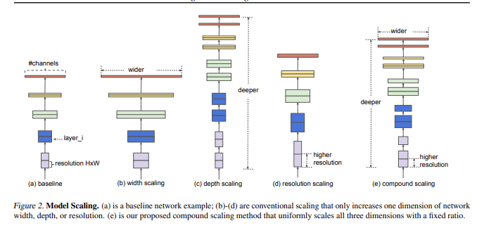
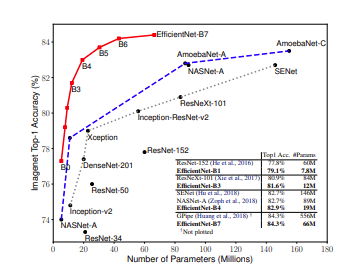
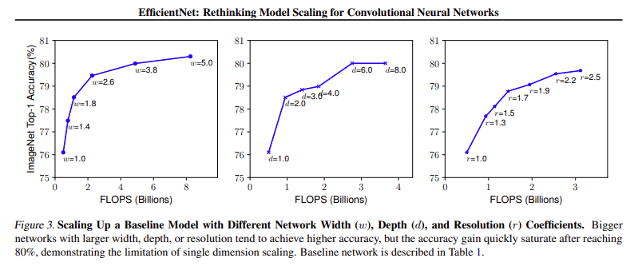
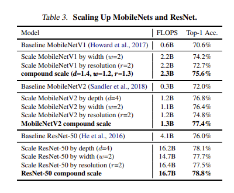
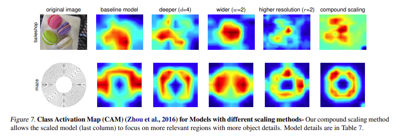

# EfficientNet论文摘要

## 核心思想

EfficientNet提出了一种**复合缩放方法**，通过系统性地平衡网络深度、宽度和分辨率三个维度来提升卷积神经网络的性能，而不是传统上单独缩放某一个维度。

## 关键发现

1. **维度间相互依赖**：网络深度、宽度和分辨率不是独立的，需要协调缩放
2. **单一维度缩放的局限性**：单独增加深度、宽度或分辨率都会遇到精度回报减弱的问题
3. **复合缩放的优势**：平衡三个维度可以获得更好的精度和效率

## 复合缩放方法

使用复合系数φ统一缩放三个维度：
- 深度：α^φ
- 宽度：β^φ  
- 分辨率：γ^φ

其中α, β, γ是通过小规模网格搜索确定的常数，满足约束：α·β²·γ² ≈ 2

## EfficientNet架构

1. **基线网络**：使用神经架构搜索设计EfficientNet-B0
2. **缩放过程**：
   - 步骤1：固定φ=1，搜索最优的α, β, γ
   - 步骤2：固定α, β, γ，通过调整φ获得EfficientNet-B1到B7

## 实验结果

### ImageNet性能
- **EfficientNet-B7**：达到84.4% top-1准确率和97.1% top-5准确率
- **效率提升**：比之前最佳卷积网络小8.4倍，快6.1倍
- **对比ResNet-50**：EfficientNet-B4在相似计算量下将准确率从76.3%提升到82.6%

### 迁移学习性能
在多个数据集上达到最先进水平：
- CIFAR-100：91.7%
- Flowers：98.8%
- 其他3个迁移学习数据集

## 技术优势

1. **系统性方法**：首次经验性量化深度、宽度和分辨率之间的关系
2. **高效搜索**：只需在小基线网络上搜索一次缩放系数
3. **广泛适用性**：方法也适用于MobileNets和ResNets等其他架构
4. **可视化验证**：复合缩放方法使模型更能关注图像中相关目标的细节区域

## 实际意义

EfficientNet提供了一种原则性的模型缩放方法，能够在有限的计算资源下获得最佳的精度-效率平衡，特别适合移动端和边缘计算场景的应用。

# EfficientNet论文详解

## 摘要

卷积神经网络通常都是先在固定资源预算下开发设计，然后如果资源有多余的话再将模型结构放大以便获得更好的精度。在本篇论文中，我们系统地研究了模型缩放并且仔细验证了网络深度、宽度和分辨率之间的平衡可以导致更好的性能表现。基于这样的观察，我们提出了一种新的缩放方法——使用一个简单高效的复合系数来完成对深度/宽度/分辨率所有维度的统一缩放。我们在MobileNets和ResNet上展示了这种缩放方法的高效性。

为了进一步研究，我们使用神经架构搜索设计了一个baseline网络，并且将模型放大获得一系列模型，我们称之为EfficientNets，它的精度和效率比之前所有的卷积网络都好。尤其是我们的EfficientNet-B7在ImageNet上获得了最先进的84.4%的top-1精度和97.1%的top-5精度，同时比之前最好的卷积网络大小缩小了8.4倍、速度提高了6.1倍。我们的EfficientNets也可以很好的迁移，并且实现了最先进的精度——CIFAR-100（91.7%）、Flowers（98.8%）、其他3个迁移学习数据集。

## 1. Introduction

为了获得更好的精度，放大卷积神经网络是一种广泛的方法。举个例子，ResNet可以通过使用更多层从ResNet-18放大到ResNet-200；目前为止，GPipe通过将baseline模型放大四倍在ImageNet数据集上获得了84.3%的top-1精度。然而，放大CNN的过程从来没有很好的理解过，目前通用的几种方法是放大CNN的深度、宽度和分辨率，在之前都是单独放大这三个维度中的一个，尽管任意放大两个或者三个维度也是可能的，但是任意缩放需要繁琐的人工调参同时可能产生的是一个次优的精度和效率。

在本篇论文中，我们想要研究和重新思考放大CNN的过程，尤其地，我们调查了一个中心问题：是否存在一个原则性的放大CNN的方法实现更好的精度和效率？我们的实验研究表明了平衡深度、宽度和分辨率这三个维度是至关重要的，令人惊讶的是这样的平衡可以通过简单的使用一组常量比率来缩放每一个维度。基于这个观察，我们提出了一个简单高效的复合缩放方法，不像传统实践中任意缩放这些因子，我们的方法使用一组固定的缩放系数统一缩放网络深度、宽度和分辨率。举个例子，如果想使用2^φ倍的计算资源，我们可以简单的对网络深度扩大α^φ倍、宽度扩大β^φ、图像尺寸扩大γ^φ倍，这里的α, β, γ都是由原来的小模型上做微小的网格搜索决定的常量系数。

直观来讲，如果图像尺寸变大，复合的缩放方法会很有意义，因为当图像尺寸变大意味着网络需要更多层来增加接受野，同时需要更多的通道来捕捉更大图像上更多细粒度的模式信息。事实上，以前的理论（Raghu等，2017; Lu等，2018）和实证结果（Zagoruyko＆Komodakis，2016）两者表明网络宽度和深度之间存在一定的关系，但据我们所知，我们是第一个凭经验量化网络宽度、深度和分辨率的三者关系。

我们在已经存在的MobileNets和ResNets上展示了我们的缩放方法可以工作得很好，值得注意的是，模型缩放的高效性严重地依赖于baseline网络。为了进一步研究，我们使用网络结构搜索发展了一种新的baseline网络，然后将它缩放来获得一系列模型，称之为EfficientNets。

Figure 1总结了ImageNet的表现，EfficientNets优于其他CNN网络，尤其地，我们的EfficientNet-B7超越了之前最好的GPipe的精度，但是参数量少了8.4倍、速度快了6.1倍。相比于广泛使用的ResNet-50，我们的EfficientNets-B4在相近的FLOPS下将top-1精度从76.3%提高到了82.6%。除了ImageNet，EfficientNets在其他数据集上表现也很好，在8个广泛应用的数据集中的5个实现了最先进的精度，然而比存在的卷积网络的参数量减少了21倍。

## 2. Related Work

### ConvNet精度

自从AlexNet赢得2012的ImageNet竞赛，ConvNets随着变得更大获得了更高的精度，同时GoogleNet使用6.8M的参数获得了74.8%的top-1精度，SENet使145M参数获得了82.7%的top-1精度。最近，GPipe进一步提高了精度——使用了557M的参数获得了84.3%的top-1验证精度：它如此的大以至于需要将网络划分使用特定的并行化手段训练，然后将每一部分传递到一个不同的加速器。然而这些模型主要是为ImageNet设计，但是将其迁移到其他应用上时效果也很好。

### ConvNet效率

深度网络的参数过多，模型压缩是一种通用的方法减小模型大小——平衡精度和效率。当移动网络变得无处不在时，我们也通常要手动设计高效的ConvNets，比如SqueezeNets、MobileNets、ShuffleNets。最近，神经网络结构搜索在设计高效的ConvNets变得越来越流行，并且通过广泛搜索网络宽度、深度、卷积核类型和大小得到了比手动设计的模型更高的精度。然而，目前还不清楚怎么将这些技术应用到更大的模型中，通常要更大的设计空间和更贵的微调成本。在本篇论文中，我们旨在研究效率设计更大规模的ConvNets，为了实现这个目标，我们采用模型缩放。

### 模型缩放

有很多的方法因不同的资源限制对ConvNet进行缩放：ResNet可以通过调整深度（缩小到ResNet-18，放大到ResNet-200），WideResNet和MobileNets可以通过对宽度（#channels）缩放。公认的是更大的输入图像尺寸有利于提高精度，同时需要更多的计算量。尽管之前的研究展示了网络深度和宽度对ConvNets的表现力很重要，它仍然是一个开放的问题来高效缩放ConvNet获得更好的效率和精度。我们的工作系统地研究了ConvNet对网络深度、宽度和分辨率这三个维度进行了缩放。

## 3. Compound Model Scaling

在本节中，我们将缩放问题公式化，研究了不同的方法并且提出了我们新的缩放方法。

### 3.1. Problem Formulation

卷积层 i 可以用公式 $Y_i = F_i(X_i)$ 定义，$F_i$ 代表卷积操作，$Y_i$ 表示输出张量，$X_i$ 表示输入张量，$X_i$ 表示输入张量的形状，$H_i, W_i$ 是feature map的尺寸，$C_i$ 是feature map的输入通道数。卷积N可以用一系列组成层表示：$N = F_k \odot ... \odot F_2 \odot F_1(X_1) = \bigodot_{j=1...k} F_j(X_1)$。实践中，ConvNet层经常被划分为多个stages，并且每个stage的所有层共享相同的结构：举个例子，ResNet有5个stages，每个stage的所有层有相同的卷积类型（除了第一层有一个下采样）。因此，我们可以将ConvNet定义为：

$$N = \bigodot_{i=1...s} F_i^{L_i}(X_{<H_i, W_i, C_i>})$$

N是分类网络，X表示输入，$F_i$ 是基础网络层，$L_i$ 表示在第i个stage中基础网络层 $F_i$ 的重复次数，总共有s个stage。Figure 2(a)展示了一种代表性的ConvNet，其空间维度，即feature map的尺寸逐层递减，但是通道维度是逐渐增加的，举个例子，从最开始的输入维度<224,224,3>变化到最终的输出维度<7,7,512>。

不像规则的ConvNets设计，大多聚焦于发现最好的基础网络层 $F_i$，然后再利用模型缩放在不改变预先在baseline网络定义好的 $F_i$ 的前提下扩展网络深度 $L_i$、宽度 $C_i$、分辨率 $(H_i, W_i)$。通过固定 $F_i$，模型缩放简化了资源约束条件，但是它仍然有一个比较大的搜索空间 $d, w, r$。为了更进一步减小设计空间，我们限制所有层都统一以一个常量比例缩放。我们的目标是在给定资源预算下最大化模型精度，可以定义为如下优化问题：

[神经网络的宽度（Width）](./ref.md)

这里的w,d,r是缩放网络分别对宽度、深度、分辨率的缩放系数，$F_i, L_i, H_i, W_i, C_i$ 是预先在baseline网络中定义好的参数。

### 3.2. Scaling Dimensions

#### 深度（d）

缩放网络深度在许多ConvNets都有使用，直觉上更深的网络可以捕获到更丰富和更复杂的特征，在新任务上也可以泛化的更好。然而，更深的网络由于梯度消失问题（这里我更倾向于说成是网络退化问题）也更难训练。尽管有一些技术，例如跨层连接、批量归一化等可以有效减缓训练问题，但是深层网络的精度回报减弱了：举个例子，ResNet-1000和ResNet-101具有类似的精度，即使它的层数更多。Figure 3（中间的图）展示了我们在使用不同的深度系数d缩放网络的研究结果，更近一步的表明了精度回报的减弱问题。

#### 宽度（w）

缩放网络宽度也是一种常用的手段，正如之前讨论过的，更宽的网络可以捕捉到更细粒度的特征从而易于训练。然而，非常宽而又很浅的网络在捕捉高层次特征时有困难，我们的实验结果Figure 3（左）表明了当网络宽度随着w变大时，精度很快就饱和了。

#### 分辨率（r）

使用更高分辨率的输入图像，ConvNets可能可以捕捉到更细粒度的模式。从最早的224x224，现在有些ConvNets为了获得更高的精度选择使用229x229或者331x331。目前，GPipe使用480x480的分辨率获得了最先进的ImageNet精度，更好的精度比如600x600也被广泛使用在目标检测网络中。Figure 3（右）展示了缩放网络分辨率对精度的影响，同样可以看到在非常高的分辨率时网络精度回报会减弱。

由此，我们得到 **Observation 1**：对网络深度、宽度和分辨率中的任何维度进行缩放都可以提高精度，但是当模型足够大时，这种放大的收益会减弱。

### 3.3. Compound Scaling

我们经验上可以观察到不同缩放维度之间是不独立的，直观上来讲，对于分辨率更高的图像，我们应该增加网络深度，因为需要更大的感受野来帮助捕获更多像素点的类似特征，同时也应该增加网络宽度来获得更细粒度的特征。这些直觉指导着我们去协调平衡不同缩放维度而不是传统的单个缩放维度。

为了验证我们的直觉，我们在不同的网络深度和分辨率下比较了宽度变化的影响，正如Figure 4中所示，如果我们在d=1.0和r=1.0时仅仅缩放网络宽度，精度很快就饱和了。但是在d=2.0和r=2.0时在相同的FLOPS下宽度缩放就可以获得更好的精度。这些结果导致我们得到了第二个观察结果。

**Observation 2**：为了追求更好的精度和效率，在缩放时平衡网络所有维度至关重要。

事实上，之前的一些工作已经开始在追求任意缩放网络深度和宽度，但是他们仍然需要复杂的人工微调。在本篇论文中，我们提出了一个新的复合缩放方法——使用一个复合系数φ统一缩放网络宽度、深度和分辨率：

$$\text{depth: } d = α^φ$$
$$\text{width: } w = β^φ$$
$$\text{resolution: } r = γ^φ$$
$$\text{s.t. } α · β^2 · γ^2 ≈ 2$$
$$α ≥ 1, β ≥ 1, γ ≥ 1$$

这里的α, β, γ都是由一个很小范围的网络搜索得到的常量。直观上来讲，φ是一个特定的系数，可以控制用于资源的使用量，α, β, γ决定了具体是如何分配资源的。值得注意的是，常规卷积op的计算量是和d, w², r²成正比的，加倍深度会使得FLOPS加倍，但是加倍宽度和分辨率会使得FLOPS加4倍。由于卷积ops经常在CNN中占据了大部分计算量，使用等式（3）缩放ConvNet将会使得整体计算量近似增加(α · β² · γ²)^φ倍。在本篇论文中，我们对任意α, β, γ增加了约束α · β² · γ² ≈ 2，整体的计算量近似增加了2^φ倍。

## 4. EfficientNet Architecture

因为模型缩放不改变baseline网络中的操作符F_i，所以有一个好的baseline网络是很重要的。我们使用之前的ConvNets对我们的缩放方法做了评估，但是为了更好验证我们的缩放方法的高效性，我们也提出了一种基于移动应用的baseline模型——EfficientNet。

受到MnasNet的启发，我们也开发了一种多目标的神经网络结构搜索同时优化精度和FLOPS，我们的搜索空间和MnasNet相同，同时我们的优化目标为ACC(m) × [FLOPS(m)/T]^w，这里的ACC(m)和FLOPS(m)分别是模型m的精度和计算量，T是目标计算量，w是一个超参数用来权衡精度和FLOPS。不像MnasNet中的优化目标，这里优化的是FLOPS而不是延迟，因为我们没有说是要在特定的硬件平台上做加速。我们的搜索方法得到了一个高效的网络，我们称之为EfficientNet-B0，因为我们使用的搜索空间和MnasNet相似，所以得到的网络结构也很相似，不过我们的EfficientNet-B0稍微大了点，因为我们的FLOPS预算也比MnasNet中大（400M）。

Table 1展示了EfficientNet-B0的结构，它的主要构建块就是移动倒置瓶颈MBConv。

然后以EfficientNet-B0为baseline模型，我们将我们的复合缩放方法应用到它上面，分为两步：

**STEP 1**：我们首先固定φ=1，假设有相比于原来多了2倍的资源，我们基于等式（2）和（3）先做了一个小范围的搜索，最后发现对于EfficientNet-B0来说最好的值为α=1.2, β=1.1, γ=1.15，在α · β² · γ² ≈ 2的约束下；

**STEP 2**：接着我们固定α, β, γ作为约束，然后利用不同取值的φ对baseline网络做放大，来获得Efficient-B1到B7；

值得注意的是，直接在一个大模型上搜索得到α, β, γ可能会导致一个更好的表现，但是搜索成本会很高。我们的方法解决了这个问题——STEP 1时只在小的baseline网络中做了一次搜索得到α, β, γ，然后对于其他的模型都使用的是相同的α, β, γ，只是通过φ来调整模型的大小和FLOPS。

## 5. Experiments

### 5.1. Scaling Up MobileNets and ResNets

为了验证我们的方法，我们首先将缩放方法应用到MobileNets和ResNets中。Table 3展示了以不同的方法缩放的ImageNet结果。与其他单一维度的缩放方法相比，我们的复合缩放方法精度提高了。

### 5.2. ImageNet Results for EfficientNet

我们采用了和MnasNet相似的设置对我们的EfficientNet模型进行训练：

- RMSProp优化器，decay为0.9，momentum为0.9；
- batch norm momentum为0.99；
- weight decay为1e-5；
- 初始学习率为0.256，并且每2.4个epoches衰减0.97；
- 同时使用了swish activation，固定的增强技术，随机深度（drop connect ratio为0.2）；
- 更大的模型需要更强的正则化，所以我们线性地增加dropout比率从EfficientNet-B0的0.2到EfficientNet-B7的0.5；

### 5.3. Transfer Learning Results for EfficientNet

## 6. Discussion

下面是使用了我们的复合缩放方法后精度的提升效果：

为了更近一步的理解为什么我们的复合缩放方法就比其他的方法效果好，Figure 7比较了使用不同方法的模型得到的class activation map的效果图。所有的这些模型都是从baseline模型缩放得到的，它们的统计特性如图Table 7。图片是随机从验证集中得到的，正如在figure中可见，复合缩放得到的模型倾向聚焦于与更多目标细节相关的区域，而其他的模型要么缺乏目标细节，要么不能捕捉到图片中所有的目标。

## 核心贡献总结

1. **系统性研究**：首次对CNN模型缩放的三个维度（深度、宽度、分辨率）进行系统研究
2. **关键观察**：发现三个维度需要平衡缩放，单一维度缩放会遇到收益递减问题
3. **复合缩放方法**：提出使用复合系数统一缩放三个维度的原则性方法
4. **EfficientNet架构**：通过神经架构搜索设计高效基线网络，并应用复合缩放方法
5. **卓越性能**：在ImageNet和多个迁移学习数据集上达到最先进水平，同时显著提升效率

## 实际意义

EfficientNet提供了一种原则性的模型缩放方法，能够在有限的计算资源下获得最佳的精度-效率平衡，特别适合移动端和边缘计算场景的应用。该方法不仅适用于新设计的网络，也可以用于改进现有的网络架构。