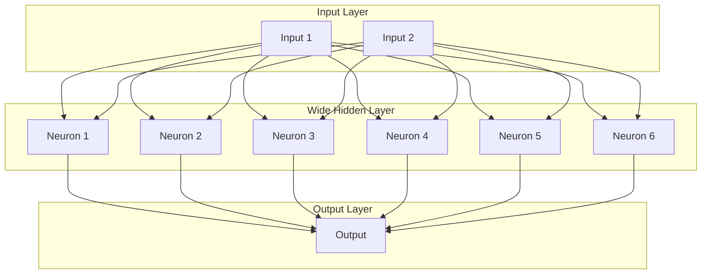

# 神经网络的宽度（Width）

### 核心定义

**神经网络的宽度（Width）** 通常指的是网络中**单个隐藏层所包含的神经元（Neurons）或单元（Units）的数量**。

---

### 详细解释

为了更好地理解，我们可以将一个神经网络的结构分为三个维度：

1.  **深度（Depth）**： 网络中**隐藏层的数量**。层数越多，网络越“深”。这是“深度学习”一词的由来。
2.  **宽度（Width）**： 网络中**某一特定隐藏层所包含的神经元数量**。神经元越多，该层越“宽”。
3.  **输入/输出维度**： 输入层和输出层的神经元数量，通常由要解决的问题（如特征数量、分类类别数）直接决定，一般不称为“宽度”。

#### 一个简单的例子：

下图展示了一个相对“较宽”的隐藏层：

在这个例子中：
*   **深度**： 有 1 个隐藏层（深度较浅）。
*   **宽度**： 该隐藏层有 6 个神经元（宽度较宽）。
*   相比之下，一个只有 2 或 3 个神经元的隐藏层就是“较窄”的。

---

### 宽度的影响

网络的宽度对其能力有着直接且重要的影响：

1.  **表示能力（Representation Capacity）**：
    *   **更宽的网络**可以学习到**更复杂、更精细的特征组合**。每一个神经元都可以学习到输入数据中不同的模式或特征。宽度越大，网络能捕获的模式就越多。
    *   理论上，**万能近似定理（Universal Approximation Theorem）** 指出，即使只有一个隐藏层，只要它有足够的宽度，就能以任意精度近似任何连续函数。这凸显了宽度的重要性。

2.  **参数数量（Number of Parameters）**：
    *   增加宽度会**显著增加**网络的参数数量（主要是权重 Weight 和偏置 Bias）。参数数量的增长与宽度成正比。
    *   例如，如果输入层有 100 个神经元，将一个隐藏层从 10 个神经元加宽到 100 个神经元，仅这一层的权重参数就会从 `100 * 10 = 1000` 个增加到 `100 * 100 = 10,000` 个。
    *   更多的参数意味着：
        *   **需要更多的数据**来训练，以避免过拟合（Overfitting）。
        *   **更高的计算开销**和**更大的内存占用**。

3.  **与深度的区别与联系**：
    *   **深度**（增加层数）使网络能够学习**层次化的、抽象的特征**（例如：从边缘 -> 纹理 -> 物体部件 -> 整个物体）。
    *   **宽度**（增加每层神经元数）使网络能够在**同一抽象层次上学习更多种类的特征**。
    *   现代深度学习架构（如Transformer中的FFN层、大型MLP）通常同时利用**极大的深度和宽度**来构建强大的模型。

### 总结

| 特性 | 深度（Depth） | 宽度（Width） |
| :--- | :--- | :--- |
| **定义** | 隐藏层的数量 | **单个隐藏层中神经元的数量** |
| **主要作用** | 学习层次化的、抽象的特征 | 在同一层次上学习更多种类的特征 |
| **参数影响** | 增加深度会增加参数，但增长相对较慢（是线性或多项式关系） | **增加宽度会显著增加参数**（通常是平方关系），对计算资源影响更大 |
| **理论保证** | 深度带来了效率上的优势（用更少的参数表示更复杂的函数） | 万能近似定理（即使一层，只要足够宽，就能近似任何函数） |

简单来说，**网络的宽度决定了每一层“脑力”的大小**，而深度决定了“思考”的层次。设计网络时，需要在深度和宽度之间取得平衡，以在有限的计算资源下达到最佳性能。