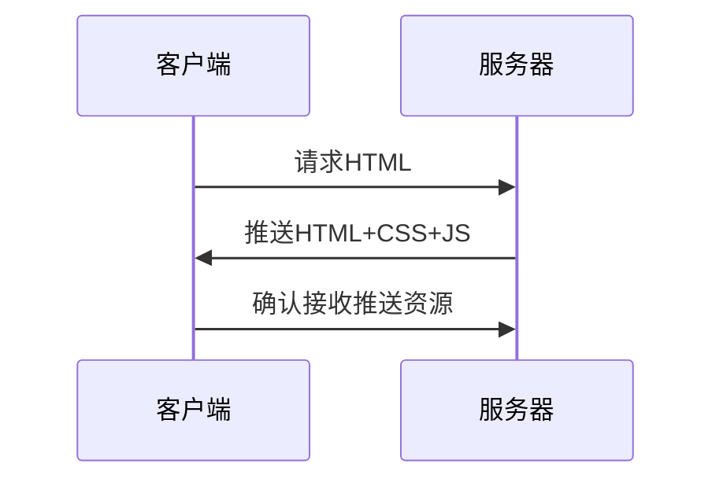
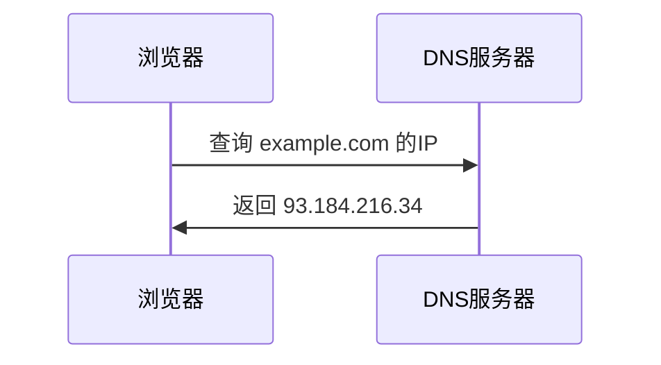
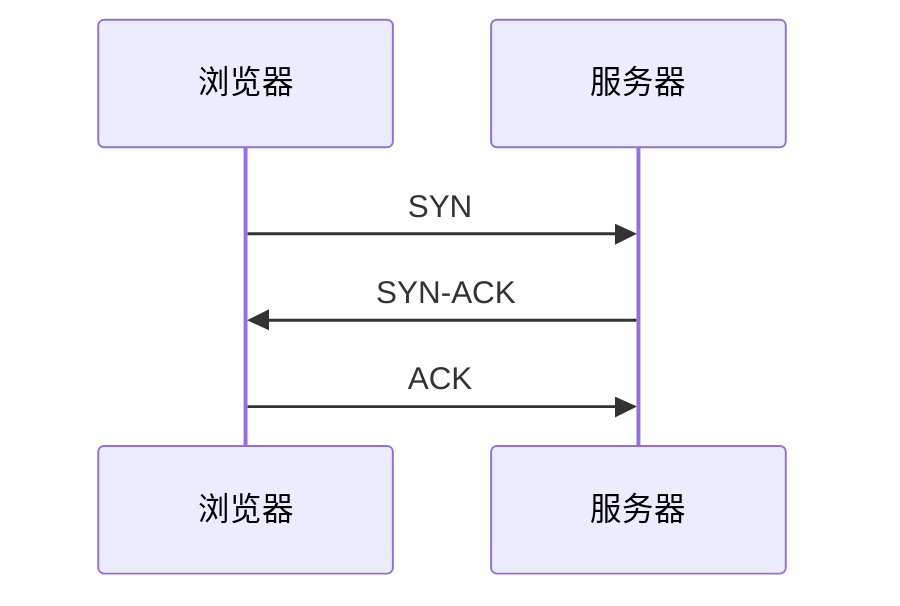
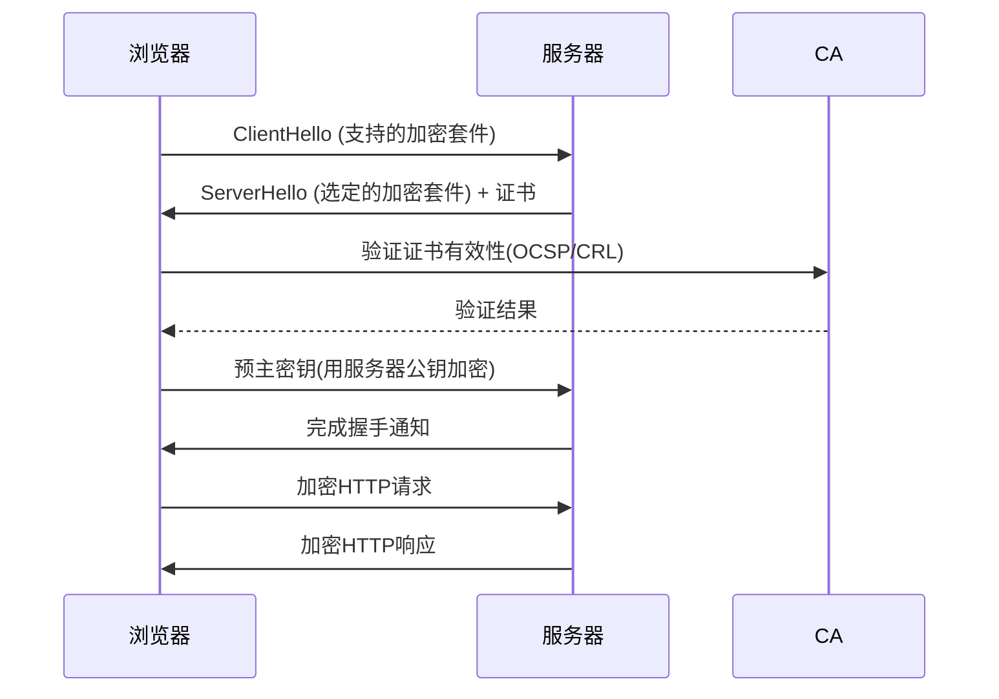
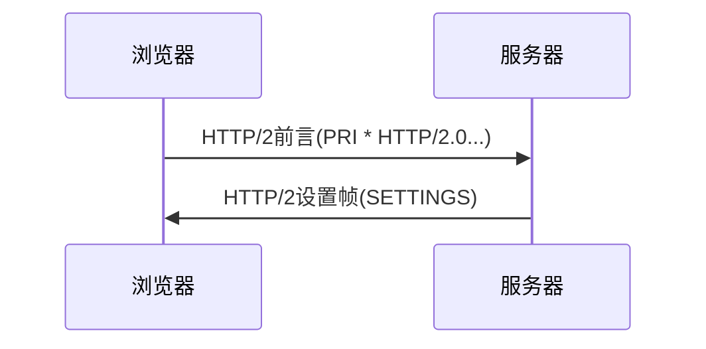

# HTTP 与 HTTPS 的区别详解

HTTP (HyperText Transfer Protocol) 和 HTTPS (HTTP Secure) 是互联网上最常用的两种通信协议，它们在安全性、工作原理和性能等方面有显著差异。

## 一、核心区别对比

| 特性                | HTTP                          | HTTPS                         |
|---------------------|-------------------------------|-------------------------------|
| **安全性**          | 明文传输，不安全              | 加密传输，安全                |
| **默认端口**        | 80                            | 443                           |
| **协议层**          | 应用层协议                    | HTTP + SSL/TLS 加密层         |
| **证书要求**        | 不需要                        | 需要CA颁发的SSL证书           |
| **加密方式**        | 无加密                        | 对称加密 + 非对称加密         |
| **数据完整性**      | 无法保证                      | 通过MAC(消息认证码)保证       |
| **SEO影响**         | 无特殊优势                    | 谷歌等搜索引擎会优先排名      |
| **性能消耗**        | 低                            | 较高(加密/解密需要CPU资源)    |
| **URL前缀**         | `http://`                     | `https://`                    |

## 二、HTTPS 的工作原理

HTTPS 通过 SSL/TLS 协议在 HTTP 和 TCP 之间增加了一个安全层：

1. **SSL/TLS 握手**：
   - 客户端发送支持的加密算法列表
   - 服务器选择加密方式并返回证书
   - 客户端验证证书并生成会话密钥
   - 使用公钥加密会话密钥发送给服务器
   - 服务器用私钥解密获得会话密钥

2. **加密通信**：
   - 后续通信使用对称加密(如AES)保障效率
   - 每段消息都包含MAC防止篡改

## 三、HTTPS 的核心优势

1. **数据加密**：
   - 防止中间人攻击(MITM)
   - 保护敏感信息(密码、信用卡号等)

2. **身份认证**：
   - CA机构验证服务器身份
   - 防止钓鱼网站冒充

3. **数据完整性**：
   - 防止传输过程中被篡改
   - 通过哈希校验确保数据完整

## 四、性能考量

虽然HTTPS有性能开销，但现代优化技术已大幅降低影响：

1. **TLS 1.3**：握手时间减少到1-RTT(甚至0-RTT)
2. **HTTP/2**：多路复用降低延迟
3. **OCSP Stapling**：减少证书验证时间
4. **会话恢复**：重用之前协商的参数

## 五、何时必须使用HTTPS？

1. 所有包含登录/支付功能的网站
2. 涉及用户隐私数据的传输
3. 渐进式Web应用(PWA)
4. 需要Service Worker的网站
5. 希望获得更好SEO排名的网站

## 六、迁移到HTTPS的注意事项

1. 选择受信任的CA机构购买证书
2. 使用301重定向将HTTP流量转向HTTPS
3. 更新所有内部链接和资源引用
4. 在HSTS预加载列表中注册域名
5. 定期更新SSL/TLS证书

HTTPS已成为现代Web的标准配置，各大浏览器已开始将纯HTTP网站标记为"不安全"。随着Let's Encrypt等免费CA的出现，部署HTTPS的成本已大幅降低。

# HTTP/1.0 与 HTTP/2.0 核心区别详解

HTTP/2.0 是 HTTP 协议的重大升级，针对 HTTP/1.0/1.1 的性能瓶颈进行了全面优化。以下是两者的关键区别：

## 一、核心架构对比

| 特性                | HTTP/1.0/1.1                  | HTTP/2.0                      |
|---------------------|-------------------------------|-------------------------------|
| **传输方式**        | 文本协议                      | 二进制分帧协议                |
| **连接复用**        | 需要多个TCP连接(1.0)或管道化(1.1) | 单连接多路复用                |
| **头部压缩**        | 无压缩，重复传输              | 使用HPACK算法压缩             |
| **服务器推送**      | 不支持                        | 支持主动推送资源              |
| **请求优先级**      | 无优先级控制                  | 可设置请求优先级              |
| **流量控制**        | 基于TCP的简单控制             | 精细的流级别流量控制          |
| **错误恢复**        | 断开连接重试                  | 无需断开连接，流级别恢复      |

## 二、关键改进解析

### 1. 二进制分帧层（Binary Framing Layer）
HTTP/2 将通信分解为：
- **帧(Frame)**：最小通信单位(HEADERS/DATA/PRIORITY等)
- **流(Stream)**：独立的双向字节流，包含多个帧
- **消息(Message)**：完整请求/响应，对应一个逻辑HTTP消息

```plaintext
HTTP/2通信模型：
[ 应用层(HTTP) ]
       ↓↑
[ 二进制分帧层 ] ← 多路复用
       ↓↑
[ 传输层(TCP)  ]
```

### 2. 多路复用（Multiplexing）
- **HTTP/1.0问题**：每个请求需单独TCP连接
- **HTTP/1.1改进**：持久连接，但仍有队头阻塞
- **HTTP/2解决方案**：
  ```plaintext
  单TCP连接上并行传输多个请求/响应
  请求A帧1 → 请求B帧1 → 请求A帧2 → 请求B帧2
  ```

### 3. 头部压缩（HPACK）
- **问题**：HTTP/1.x头部重复传输且未压缩
- **解决方案**：
  - 静态霍夫曼编码
  - 维护头部字段表（静态表+动态表）
  - 相同连接中后续请求只需发送差异部分

### 4. 服务器推送（Server Push）

- 服务器可预测客户端需求，主动推送资源
- 客户端可拒绝不需要的推送(CANCEL_FRAME)

## 三、性能影响对比

### 页面加载测试示例（假设10个资源）
| 指标                | HTTP/1.1(6个并发连接) | HTTP/2.0(单连接) |
|---------------------|----------------------|-----------------|
| **TCP连接数**       | 6                    | 1               |
| **总延迟**          | 3×RTT                | 1×RTT           |
| **头部开销**        | ~800B×10=8KB         | ~200B(压缩后)   |
| **队头阻塞**        | 存在                 | 不存在          |

## 四、协议升级要点

1. **兼容性**：
   - HTTP/2必须使用HTTPS（浏览器实现要求）
   - 通过ALPN(Application-Layer Protocol Negotiation)协商

2. **部署要求**：
   ```nginx
   # Nginx配置示例
   listen 443 ssl http2;
   ssl_certificate /path/to/cert.pem;
   ssl_certificate_key /path/to/key.pem;
   ```

3. **调试工具**：
   - Chrome DevTools的"Protocol"列显示`h2`
   - Wireshark过滤`http2`流量
   - `curl -v --http2 https://example.com`

## 五、注意事项

1. **TCP层优化**：
   - 建议开启TCP快速打开(TFO)
   - 调整TCP拥塞窗口大小

2. **推送策略**：
   - 只推送高概率使用的资源
   - 避免推送过大资源

3. **缓存管理**：
   - 推送资源也需要设置合适缓存头

HTTP/2通过二进制协议、多路复用和头部压缩等技术，显著提升了Web性能。根据W3Techs数据，截至2023年，全球已有超过40%的网站支持HTTP/2，成为现代Web的基础协议。

# CA 与 HTTPS 实现的效果及浏览器访问网站的完整流程

## 一、CA (证书颁发机构) 与 HTTPS 实现的安全效果

### 1. CA 的核心作用
- **身份认证**：验证网站所有者身份，确保证书持有者是合法实体
- **信任锚点**：作为第三方信任机构，构建信任链体系
- **密钥分发**：安全分发网站的公钥信息

### 2. HTTPS 实现的安全效果
| 安全目标       | 实现机制                          | 技术保障                         |
|----------------|-----------------------------------|----------------------------------|
| **机密性**     | 对称加密(AES等)                   | 防止数据被窃听                   |
| **完整性**     | 消息认证码(MAC/HMAC)              | 防止数据被篡改                   |
| **身份认证**   | 数字证书 + 非对称加密(RSA/ECC)    | 防止中间人攻击                   |
| **不可否认性** | 数字签名                          | 通信行为可追溯                   |

## 二、浏览器访问 HTTPS 网站的完整流程

### 1. DNS 解析阶段


### 2. TCP 连接建立


### 3. TLS/SSL 握手流程（关键安全阶段）


**详细握手过程**：
1. **ClientHello**：浏览器发送TLS版本、支持的加密算法、随机数A
2. **ServerHello**：服务器选择加密算法、发送随机数B和证书
3. **证书验证**：
   - 检查证书有效期
   - 验证证书链(根CA→中间CA→站点证书)
   - 检查吊销状态(OCSP/CRL)
4. **密钥交换**：浏览器生成预主密钥，用服务器公钥加密传输
5. **会话密钥生成**：双方通过随机数A+B+预主密钥计算会话密钥
6. **加密通信**：后续数据使用对称加密传输

### 4. HTTP/2 连接建立（现代网站）


### 5. 资源加载与渲染
1. 浏览器解析HTML并构建DOM树
2. 对CSS/JS/图片等子资源发起HTTPS请求
3. 处理服务器推送的资源(HTTP/2特性)
4. 执行JavaScript并完成页面渲染

## 三、关键安全机制详解

### 1. 证书验证过程
```python
def verify_certificate(cert):
    # 1. 检查有效期
    if not cert.validity_period.check():
        raise "证书过期"
    
    # 2. 验证证书链
    current = cert
    while current.issuer != root_ca:
        if not current.verify_signature():
            raise "签名验证失败"
        current = get_parent_cert(current)
    
    # 3. 检查吊销状态
    if check_ocsp(cert) == REVOKED:
        raise "证书已被吊销"
    
    # 4. 检查域名匹配
    if cert.subject != requested_domain:
        raise "域名不匹配"
```

### 2. 混合加密体系
- **非对称加密**：用于密钥交换(RSA/ECDHE)
- **对称加密**：用于数据传输(AES-256-GCM)
- **前向保密**：临时密钥会话结束后立即销毁

## 四、性能优化技术

1. **TLS 1.3**：握手时间从2-RTT减少到1-RTT
2. **OCSP Stapling**：服务器代为查询证书状态
3. **会话恢复**：Session ID/Tickets避免重复握手
4. **HSTS**：强制HTTPS减少302跳转
   ```http
   Strict-Transport-Security: max-age=63072000; includeSubDomains; preload
   ```

## 五、开发者注意事项

1. **证书配置**：
   - 包含完整证书链(leaf→intermediate→root)
   - 使用SAN证书支持多域名
   - 定期轮换证书(建议不超过1年)

2. **安全配置**：
   ```nginx
   # 禁用不安全的协议和加密套件
   ssl_protocols TLSv1.2 TLSv1.3;
   ssl_ciphers 'ECDHE-ECDSA-AES256-GCM-SHA384:ECDHE-RSA-AES256-GCM-SHA384';
   ```

3. **混合内容处理**：
   - 使用Content-Security-Policy报头
   - 自动升级HTTP请求(Upgrade-Insecure-Requests)

通过这套机制，HTTPS实现了端到端的安全通信，而CA机构作为信任基石保障了互联网的身份认证体系。现代浏览器对HTTPS的支持已非常完善，Chrome等浏览器甚至会将非HTTPS网站标记为"不安全"。

